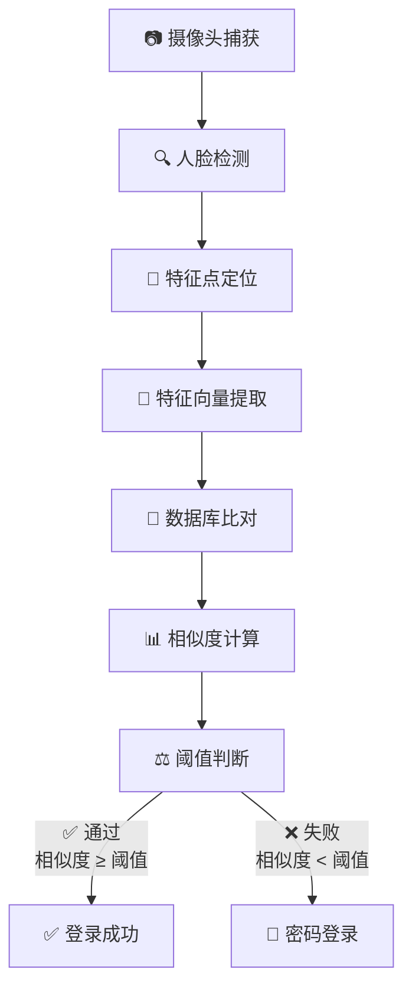
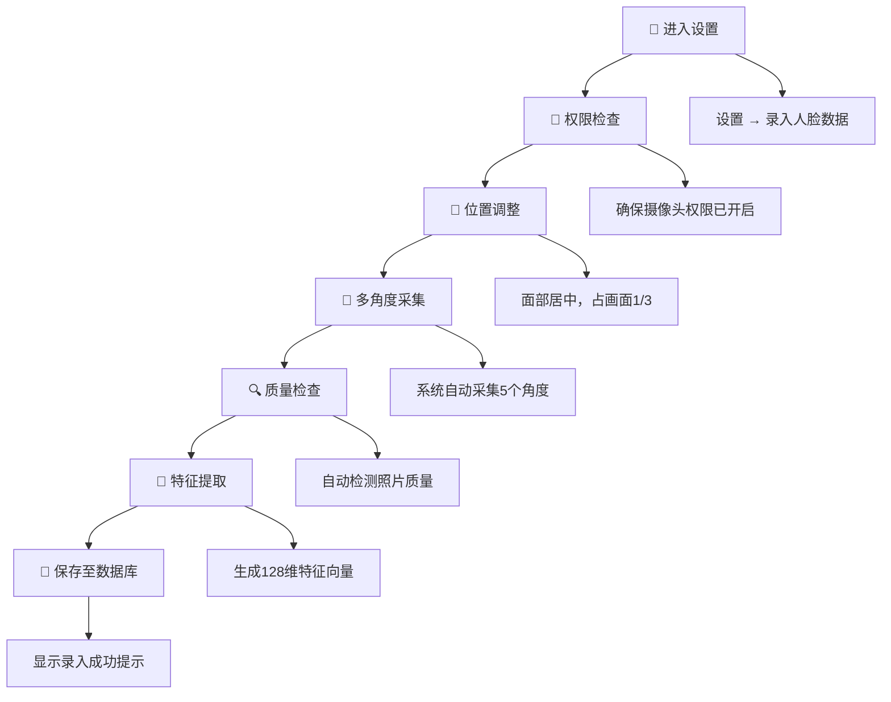

<div class="logo-card" style="position: absolute; left: 20px; top: 20px; z-index: 100;">
  
</div>

<style>
  .logo-card {
    position: relative;
    margin-top: 2em;
    margin-left: 0.5em;
    border-radius: 12px;
    overflow: hidden;
    height: 7.5em;
    width: 7.5em;
    box-shadow: 0 4px 15px rgba(0, 0, 0, 0.2);
    cursor: pointer;
    flex-shrink: 0;
  }

  /* 扫光效果 */
  .logo-card::after {
    content: "";
    position: absolute;
    top: -50%;
    left: -60%;
    width: 10%;
    height: 200%;
    background: linear-gradient(to right,
      rgba(255, 255, 255, 0) 0%,
      rgba(128, 220, 255, 0.8) 50%,
      rgba(255, 255, 255, 0) 100%);
    transform: rotate(25deg);
    z-index: 3;
    transition: all 1.8s cubic-bezier(0.23, 1, 0.32, 1);
  }

  .logo-card:hover::after {
    left: 150%;
    transition-delay: 0.1s;
  }

  /* 响应式设计 - 平板设备 */
  @media screen and (max-width: 1024px) {
    .logo-card {
      height: 6em;
      width: 6em;
    }
  }

  /* 响应式设计 - 移动设备 */
  @media screen and (max-width: 768px) {
    .logo-card {
      height: 5em;
      width: 5em;
      margin-top: 5em;
      margin-left: 0.25em;
    }
  }

  /* 响应式设计 - 小屏幕移动设备 */
  @media screen and (max-width: 480px) {
    .logo-card {
      height: 3em;
      width: 3em;
      margin-top: 5em;
      margin-left: 0.25em;
    }
  }
</style>

<style>
@import url('https://fonts.lug.ustc.edu.cn/css2?family=Orbitron:wght@400;500;600;700;800;900&display=swap');

/* 确保字体加载不阻塞内容显示 */
@font-face {
  font-family: 'Orbitron';
}
</style>

<div style="text-align: center; margin: 20px 0 30px 0; padding: 20px 15px; background: linear-gradient(135deg, #0f0c29 0%, #302b63 50%, #24243e 100%); border-radius: 12px; box-shadow: 0 8px 25px rgba(0, 0, 0, 0.3), inset 0 0 15px rgba(255, 255, 255, 0.1); backdrop-filter: blur(5px); border: 1px solid rgba(255, 255, 255, 0.15); position: relative; overflow: hidden; font-family: 'Microsoft YaHei', '微软雅黑', sans-serif; box-sizing: border-box;">
  <div style="position: absolute; top: -40px; right: -40px; width: 160px; height: 160px; background: radial-gradient(circle, rgba(41, 128, 185, 0.3) 0%, transparent 70%); border-radius: 50%;"></div>
  <div style="position: absolute; bottom: -60px; left: -20px; width: 200px; height: 200px; background: radial-gradient(circle, rgba(155, 89, 182, 0.3) 0%, transparent 70%); border-radius: 50%;"></div>
  <div style="display: flex; flex-direction: column; align-items: center;">
    <h1 style="font-weight: 800; font-size: 2.2em; margin: 0 0 10px 0; color: #fff; text-shadow: 0 2px 8px rgba(0, 0, 0, 0.5); letter-spacing: 1px; font-family: 'Orbitron', 'Roboto Mono', 'Consolas', 'Microsoft YaHei', '微软雅黑', monospace;">
      站室绩效考核系统 GRU-PA
    </h1>
    <div style="display: inline-block; border-radius: 25px; overflow: hidden; clip-path: inset(0 0 0 0 round 25px);">
      <div style="display: flex; align-items: center; justify-content: center; padding: 8px 30px; background: linear-gradient(90deg, #00c6ff 0%, #9c34d8ff 100%); box-shadow: 0 3px 10px rgba(0, 0, 0, 0.3); backdrop-filter: blur(10px); border: 1px solid rgba(255, 255, 255, 0.2); font-family: 'Microsoft YaHei', '微软雅黑', sans-serif; margin: -1px;">
        <span style="color: white; font-weight: 600; letter-spacing: 1px; font-size: 1.1em; text-shadow: 0 1px 2px rgba(0, 0, 0, 0.3);">
          完整操作手册 | 全A.I.智能生成
        </span>
      </div>
    </div>
  </div>
</div>

<div style="text-align: center; margin: 5px 0; font-family: 'Microsoft YaHei', '微软雅黑', sans-serif;">
  <h2 style="font-size: 1.2em; font-weight: 500; color: #2c3e50; margin: 4px 0;">
    让管理更简单 • 让考核更公平 • 智能化绩效管理 • 助力基层站室高效运营
  </h2>
</div>

-
    
    
    
    
    
    
    
    
    

<a id="目录"></a>

### 目录

- [Todo](#Todo)
- [系统概述](#系统概述)
- [系统安装与配置](#系统安装与配置)
- [快速入门](#快速入门)
- [用户管理](#用户管理)
- [工作量管理](#工作量管理)
- [数据统计分析](#数据统计分析)
- [值班数据统计及导出](#值班数据统计及导出)
- [周月报智能生成](#周月报智能生成)
- [公告发布和修改](#公告发布和修改)
- [人脸识别系统](#人脸识别系统)
- [天气功能](#天气功能)
- [数据导出](#数据导出)
- [数据库操作](#数据库操作)
- [数据维护](#数据维护)
- [日志审计](#日志审计)
- [用户权限管理](#用户权限管理)
- [个人设置](#个人设置)
- [系统配置](#系统配置)
- [云同步](#云同步)
- [故障排除](#故障排除)
- [安全指南](#安全指南)
- [附录-文件清单](#附录-文件清单)
- [快速命令参考](#快速命令参考)
- [技术支持](#技术支持)

<a id="Todo"></a>

### 📝 Todo

- 统计导出自定义模板
- 人脸识别最大尝试次数
- 系统会话超时
- 用户密码定期修改
- 用户修改密码不能重复使用最近5次密码
- 登录连续5次失败则锁定30分钟
- 基于IP的白名单的访问控制
- 审计所有敏感操作

- [回到目录](#目录)

<a id="系统概述"></a>

### 系统概述

### 🎯 系统定位

#### :orange[GRU-PA (Grass-roots unit Performance Appraisal system) 是一款专为基层站室设计的绩效考核管理系统，集成了工作量录入、统计分析、人脸识别、天气查询等现代化管理功能]

### 🏗️ 技术架构

<div style="display: grid; grid-template-columns: repeat(auto-fit, minmax(250px, 1fr)); gap: 15px; margin: 20px 0;">
  <div style="background: linear-gradient(135deg, #6a11cb 0%, #2575fc 100%); border-radius: 10px; padding: 20px; color: white; box-shadow: 0 4px 15px rgba(0,0,0,0.2);">
    <div style="font-size: 1.8em; margin-bottom: 10px;">🎨</div>
    <div style="font-weight: bold; font-size: 1.1em; margin-bottom: 5px;">前端框架</div>
    <div style="font-family: monospace; font-size: 1em;">Streamlit 1.48.0</div>
  </div>

  <div style="background: linear-gradient(135deg, #11998e 0%, #38ef7d 100%); border-radius: 10px; padding: 20px; color: white; box-shadow: 0 4px 15px rgba(0,0,0,0.2);">
    <div style="font-size: 1.8em; margin-bottom: 10px;">🐍</div>
    <div style="font-weight: bold; font-size: 1.1em; margin-bottom: 5px;">后端语言</div>
    <div style="font-family: monospace; font-size: 1em;">Python 3.9-3.12</div>
  </div>

  <div style="background: linear-gradient(135deg, #f7971e 0%, #ffd200 100%); border-radius: 10px; padding: 20px; color: white; box-shadow: 0 4px 15px rgba(0,0,0,0.2);">
    <div style="font-size: 1.8em; margin-bottom: 10px;">🗄️</div>
    <div style="font-weight: bold; font-size: 1.1em; margin-bottom: 5px;">数据库</div>
    <div style="font-family: monospace; font-size: 1em;">MySQL 8.4.6 LTS</div>
  </div>

  <div style="background: linear-gradient(135deg, #ff416c 0%, #ff4b2b 100%); border-radius: 10px; padding: 20px; color: white; box-shadow: 0 4px 15px rgba(0,0,0,0.2);">
    <div style="font-size: 1.8em; margin-bottom: 10px;">😊</div>
    <div style="font-weight: bold; font-size: 1.1em; margin-bottom: 5px;">人脸识别</div>
    <div style="font-family: monospace; font-size: 1em;">Dlib 20.0.0 + OpenCV 4.12</div>
  </div>

  <div style="background: linear-gradient(135deg, #7F00FF 0%, #E100FF 100%); border-radius: 10px; padding: 20px; color: white; box-shadow: 0 4px 15px rgba(0,0,0,0.2);">
    <div style="font-size: 1.8em; margin-bottom: 10px;">📊</div>
    <div style="font-weight: bold; font-size: 1.1em; margin-bottom: 5px;">图表可视化</div>
    <div style="font-family: monospace; font-size: 1em;">Plotly 6.2.0 + Nivo</div>
  </div>

  <div style="background: linear-gradient(135deg, #2193b0 0%, #6dd5ed 100%); border-radius: 10px; padding: 20px; color: white; box-shadow: 0 4px 15px rgba(0,0,0,0.2);">
    <div style="font-size: 1.8em; margin-bottom: 10px;">📄</div>
    <div style="font-weight: bold; font-size: 1.1em; margin-bottom: 5px;">文档处理</div>
    <div style="font-family: monospace; font-size: 1em;">Python-docx + Openpyxl</div>
  </div>
</div>

### ✨ 核心特性

<div style="display: grid; grid-template-columns: repeat(auto-fit, minmax(300px, 1fr)); gap: 20px; margin: 25px 0;">
  <div style="background: linear-gradient(135deg, #6a11cb 0%, #2575fc 100%); border-radius: 12px; padding: 25px; color: white; box-shadow: 0 6px 15px rgba(0,0,0,0.2); transition: all 0.3s ease;">
    <div style="font-size: 2em; margin-bottom: 15px;">🔐</div>
    <div style="font-weight: bold; font-size: 1.2em; margin-bottom: 10px;">双因子认证</div>
    <div style="font-size: 1em; opacity: 0.9;">密码 + 人脸识别双重验证</div>
  </div>

  <div style="background: linear-gradient(135deg, #11998e 0%, #38ef7d 100%); border-radius: 12px; padding: 25px; color: white; box-shadow: 0 6px 15px rgba(0,0,0,0.2); transition: all 0.3s ease;">
    <div style="font-size: 2em; margin-bottom: 15px;">⚡</div>
    <div style="font-weight: bold; font-size: 1.2em; margin-bottom: 10px;">智能录入</div>
    <div style="font-size: 1em; opacity: 0.9;">支持批量录入、手工录入，智能推荐工作内容</div>
  </div>

  <div style="background: linear-gradient(135deg, #f7971e 0%, #ffd200 100%); border-radius: 12px; padding: 25px; color: white; box-shadow: 0 6px 15px rgba(0,0,0,0.2); transition: all 0.3s ease;">
    <div style="font-size: 2em; margin-bottom: 15px;">📊</div>
    <div style="font-weight: bold; font-size: 1.2em; margin-bottom: 10px;">多维分析</div>
    <div style="font-size: 1em; opacity: 0.9;">9种图表类型，支持时间序列分析</div>
  </div>

  <div style="background: linear-gradient(135deg, #ff416c 0%, #ff4b2b 100%); border-radius: 12px; padding: 25px; color: white; box-shadow: 0 6px 15px rgba(0,0,0,0.2); transition: all 0.3s ease;">
    <div style="font-size: 2em; margin-bottom: 15px;">🌤️</div>
    <div style="font-weight: bold; font-size: 1.2em; margin-bottom: 10px;">实时天气</div>
    <div style="font-size: 1em; opacity: 0.9;">集成和风天气和高德天气API，支持历史天气和高温记录查询</div>
  </div>

  <div style="background: linear-gradient(135deg, #7F00FF 0%, #E100FF 100%); border-radius: 12px; padding: 25px; color: white; box-shadow: 0 6px 15px rgba(0,0,0,0.2); transition: all 0.3s ease;">
    <div style="font-size: 2em; margin-bottom: 15px;">📤</div>
    <div style="font-weight: bold; font-size: 1.2em; margin-bottom: 10px;">一键导出</div>
    <div style="font-size: 1em; opacity: 0.9;">Excel/Word双格式，支持自定义模板</div>
  </div>

  <div style="background: linear-gradient(135deg, #2193b0 0%, #6dd5ed 100%); border-radius: 12px; padding: 25px; color: white; box-shadow: 0 6px 15px rgba(0,0,0,0.2); transition: all 0.3s ease;">
    <div style="font-size: 2em; margin-bottom: 15px;">👮</div>
    <div style="font-weight: bold; font-size: 1.2em; margin-bottom: 10px;">权限管控</div>
    <div style="font-size: 1em; opacity: 0.9;">基于RBAC的精细化权限管理</div>
  </div>
</div>

- [回到目录](#目录)

<a id="系统安装与配置"></a>

### 系统安装与配置

### 🖥️ 系统要求

#### 服务器硬件要求

<div style="overflow-x: auto;">

| 组件 | 最低配置 | 推荐配置 |
|:-----|:---------|:---------|
| **CPU** | <span style="color: #e74c3c;">Intel i5 4代</span> | <span style="color: #27ae60;">Intel i7 12代或AMD Ryzen7 7代</span> |
| **显卡** | <span style="color: #e74c3c;">集成显卡</span> | <span style="color: #27ae60;">GeForce GTX 2080 Ti</span> |
| **内存** | <span style="color: #e74c3c;">8GB DDR3</span> | <span style="color: #27ae60;">16GB DDR5</span> |
| **存储** | <span style="color: #e74c3c;">64GB HDD</span> | <span style="color: #27ae60;">128GB SSD</span> |
| **网络** | <span style="color: #e74c3c;">100Mbps</span> | <span style="color: #27ae60;">1000Mbps</span> |
| **摄像头** | <span style="color: #e74c3c;">1080p</span> | <span style="color: #27ae60;">1080p</span> |

</div>

> 💡 **配置建议**:

- 最低配置可满足基本运行需求
- 推荐配置可获得更流畅的用户体验，特别是人脸识别功能
- 人脸识别功能对摄像头和CPU要求较高，建议采用推荐配置

#### 软件环境

<div style="display: grid; grid-template-columns: repeat(auto-fit, minmax(250px, 1fr)); gap: 25px; margin: 20px 0;">

<div style="background: linear-gradient(135deg, #1a2a6c 0%, #b21f1f 100%); border-radius: 15px; padding: 25px; color: white; box-shadow: 0 10px 20px rgba(0,0,0,0.19), 0 6px 6px rgba(0,0,0,0.23); transition: all 0.3s ease; transform: translateY(0);">
  <div style="display: flex; align-items: center; margin-bottom: 20px;">
    
    <h3 style="margin: 0; font-size: 1.5em;">Python</h3>
  </div>
  <div style="margin: 20px 0;">
    <p style="margin: 0; font-size: 1em; opacity: 0.9;">版本要求</p>
    <p style="margin: 5px 0 0 0; font-weight: bold; font-size: 1.3em;">3.9-3.12.6</p>
  </div>
  <a href="https://www.python.org" style="display: inline-block; padding: 10px 20px; background: rgba(255, 255, 255, 0.2); color: white; text-decoration: none; border-radius: 25px; font-weight: bold; transition: all 0.3s ease; border: 1px solid rgba(255, 255, 255, 0.3);">官网下载 🔗</a>
</div>

<div style="background: linear-gradient(135deg, #1e3c72 0%, #2a5298 100%); border-radius: 15px; padding: 25px; color: white; box-shadow: 0 10px 20px rgba(0,0,0,0.19), 0 6px 6px rgba(0,0,0,0.23); transition: all 0.3s ease; transform: translateY(0);">
  <div style="display: flex; align-items: center; margin-bottom: 20px;">
    
    <h3 style="margin: 0; font-size: 1.5em;">MySQL</h3>
  </div>
  <div style="margin: 20px 0;">
    <p style="margin: 0; font-size: 1em; opacity: 0.9;">版本要求</p>
    <p style="margin: 5px 0 0 0; font-weight: bold; font-size: 1.3em;">8.4.6 LTS</p>
  </div>
  <a href="https://dev.mysql.com" style="display: inline-block; padding: 10px 20px; background: rgba(255, 255, 255, 0.2); color: white; text-decoration: none; border-radius: 25px; font-weight: bold; transition: all 0.3s ease; border: 1px solid rgba(255, 255, 255, 0.3);">官网下载 🔗</a>
</div>

<div style="background: linear-gradient(135deg, #43e97b 0%, #38f9d7 100%); border-radius: 15px; padding: 25px; color: white; box-shadow: 0 10px 20px rgba(0,0,0,0.19), 0 6px 6px rgba(0,0,0,0.23); transition: all 0.3s ease; transform: translateY(0);">
  <div style="display: flex; align-items: center; margin-bottom: 20px;">
    
    <h3 style="margin: 0; font-size: 1.5em;">Git</h3>
  </div>
  <div style="margin: 20px 0;">
    <p style="margin: 0; font-size: 1em; opacity: 0.9;">版本要求</p>
    <p style="margin: 5px 0 0 0; font-weight: bold; font-size: 1.3em;">2.30+</p>
  </div>
  <a href="https://git-scm.com" style="display: inline-block; padding: 10px 20px; background: rgba(255, 255, 255, 0.2); color: white; text-decoration: none; border-radius: 25px; font-weight: bold; transition: all 0.3s ease; border: 1px solid rgba(255, 255, 255, 0.3);">官网下载 🔗</a>
</div>

<div style="background: linear-gradient(135deg, #e38a37ff 0%, #e317a3ff 100%); border-radius: 15px; padding: 25px; color: white; box-shadow: 0 10px 20px rgba(0,0,0,0.19), 0 6px 6px rgba(0,0,0,0.23); transition: all 0.3s ease; transform: translateY(0);">
  <div style="display: flex; align-items: center; margin-bottom: 20px;">
    
    <h3 style="margin: 0; font-size: 1.5em;">Visual Studio Build Tools</h3>
  </div>
  <div style="margin: 20px 0;">
    <p style="margin: 0; font-size: 1em; opacity: 0.9;">版本要求</p>
    <p style="margin: 5px 0 0 0; font-weight: bold; font-size: 1.3em;">2019+</p>
  </div>
  <a href="https://visualstudio.microsoft.com/zh-hans/downloads/" style="display: inline-block; padding: 10px 20px; background: rgba(255, 255, 255, 0.2); color: white; text-decoration: none; border-radius: 25px; font-weight: bold; transition: all 0.3s ease; border: 1px solid rgba(255, 255, 255, 0.3);">官网下载 🔗</a>
</div>

</div>

> 💡 **安装提示**:

- Python安装时请勾选"Add Python to PATH"选项
- Windows系统需要安装Visual Studio Build Tools以编译Dlib库
- 建议使用LTS版本以确保系统稳定性

### 🚀 安装步骤

1. 环境准备

    ```bash
    # Windows系统
    # 安装Python时勾选"Add Python to PATH"
    # 安装MySQL时记住root密码

    # Linux系统 (Ubuntu/Debian)
    sudo apt update && sudo apt upgrade -y
    sudo apt install python3.12 python3-pip mysql-server-8.4 git build-essential cmake
    ```

2. 获取源代码

    ```bash
    # 方法1: Git克隆
    git clone https://github.com/simonpek88/GRU-PA.git
    cd GRU-PA

    # 方法2: 直接下载
    # 从GitHub Releases下载最新版本ZIP包
    ```

3. 安装依赖

    - 主要依赖
    <style>
    .dependency-list {
        display: grid;
        grid-template-columns: repeat(auto-fit, minmax(300px, 1fr));
        gap: 15px;
        margin-top: 10px;
    }
    .dependency-item {
        background: #f8f9fa;
        border-left: 4px solid #3498db;
        padding: 12px 15px;
        border-radius: 0 8px 8px 0;
        box-shadow: 0 2px 4px rgba(0,0,0,0.05);
        transition: all 0.3s ease;
    }
    .dependency-item:hover {
        transform: translateX(5px);
        box-shadow: 0 4px 8px rgba(0,0,0,0.1);
        background: #e9f7fe;
    }
    .dependency-name {
        font-weight: 600;
        color: #2c3e50;
        font-family: 'Courier New', monospace;
    }
    .dependency-desc {
        color: #6c757d;
        font-size: 1em;
        margin-top: 5px;
    }
    .optional {
        border-left-color: #23d5e1ff;
    }
    .optional .dependency-name {
        color: #2c3e50;
    }
    /* 清除浮动影响 */
    .dependency-clear {
        clear: both;
        height: 1px;
        overflow: hidden;
        margin: 0;
        padding: 0;
    }
    </style>

    <div class="dependency-list">
    <div class="dependency-item">
    <div class="dependency-name">Streamlit</div>
    <div class="dependency-desc">前端框架</div>
    </div>
    <div class="dependency-item">
    <div class="dependency-name">Streamlit-antd-components/extras/search</div>
    <div class="dependency-desc">前端组件库</div>
    </div>
    <div class="dependency-item">
    <div class="dependency-name">Streamlit_condition_tree</div>
    <div class="dependency-desc">条件树SQL语句生成</div>
    </div>
    <div class="dependency-item">
    <div class="dependency-name">Pycryptodome</div>
    <div class="dependency-desc">数据加密模块</div>
    </div>
    <div class="dependency-item">
    <div class="dependency-name">NumPY</div>
    <div class="dependency-desc">数学计算</div>
    </div>
    <div class="dependency-item">
    <div class="dependency-name">Plotly</div>
    <div class="dependency-desc">数据可视化</div>
    </div>
    <div class="dependency-item">
    <div class="dependency-name">Nivo</div>
    <div class="dependency-desc">数据可视化</div>
    </div>
    <div class="dependency-item">
    <div class="dependency-name">Python-docx</div>
    <div class="dependency-desc">Word文档操作</div>
    </div>
    <div class="dependency-item">
    <div class="dependency-name">Openpyxl/XlsxWriter</div>
    <div class="dependency-desc">Excel文档操作</div>
    </div>
    <div class="dependency-item">
    <div class="dependency-name">PyJWT</div>
    <div class="dependency-desc">JSON Web Token认证 (和风天气API使用)</div>
    </div>
    <div class="dependency-item optional">
    <div class="dependency-name">Dlib</div>
    <div class="dependency-desc">人脸识别库 (可选)</div>
    </div>
    <div class="dependency-item optional">
    <div class="dependency-name">Face-recognition</div>
    <div class="dependency-desc">人脸识别 (可选)</div>
    </div>
    <div class="dependency-item optional">
    <div class="dependency-name">Opencv-python</div>
    <div class="dependency-desc">图像处理 (可选)</div>
    </div>
    <div class="dependency-item optional">
    <div class="dependency-name">streamlit-webrtc</div>
    <div class="dependency-desc">浏览器webrtc模块 (可选)</div>
    </div>
    </div>
    <div class="dependency-clear"></div>

      
      
      
      
      
      
      
      
      
      
      
      
      
      
      

    ```bash
    # 创建虚拟环境 (推荐)
    python -m venv gru-pa-env
    source gru-pa-env/bin/activate  #Linux/Mac
    # 或
    gru-pa-env\Scripts\activate     #Windows

    # 安装Python包
    pip install -r requirements.txt

    # 安装Dlib (Windows 请对应python版本选择对应的whl文件)
    pip install dlib/dlib-20.0.0-cp{python版本}-cp{python版本}-win_amd64.whl

    # 或Dlib编译安装
    # Windows/Linux/Mac编译
    cd dlib
    mkdir build
    cd build
    cmake .. -DDLIB_USE_CUDA=1 -DUSE_AVX_INSTRUCTIONS=1  # GPU加速
    # 或
    cmake .. # 无GPU环境
    cmake --build .
    cd ..
    # setup.py 安装
    python setup.py install
    # 或
    # 编译成wheel文件安装 (推荐)
    python setup.py bdist_wheel # 生成wheel文件
    pip install dist/dlib-20.0.0-cp{python版本}-cp{python版本}-win_amd64.whl
    ```

    ```bash
    # 验证GPU加速是否正常
    python
    import dlib
    print(dlib.DLIB_USE_CUDA)
    ```

4. 数据库配置

    ```bash
    -- 登录MySQL
    mysql -u root -p

    -- 创建数据库
    CREATE DATABASE gru_pa DEFAULT CHARACTER SET utf8mb4 COLLATE utf8mb4_unicode_ci;

    -- 创建用户并授权
    CREATE USER 'gru_pa_user'@'localhost' IDENTIFIED BY 'your_secure_password';
    GRANT ALL PRIVILEGES ON gru_pa.* TO 'gru_pa_user'@'localhost';
    FLUSH PRIVILEGES;

    -- 导入初始数据
    mysql -u gru_pa_user -p gru_pa < MySQL_Backup/GRU-PA-MySQL_Backup_{时间戳}.sql

    -- 创建.mysql.cnf (推荐)
    [client]
    user = {username}
    password = {password}
    port = {port}
    ```

5. 配置文件设置

    默认端口8510 [修改前请查阅相关文档](https://docs.streamlit.io/develop/api-reference/configuration/config.toml)

    ```bash
    # .streamlit/config.toml
    [server]
    port = 8510
    address = "localhost"
    enableCORS = true # 允许跨域

    [browser]
    gatherUsageStats = false
    ```

### 🏁 启动系统

#### 开发环境

```bash
# 直接启动
streamlit run gru-pa.py

# 指定参数启动
streamlit run gru-pa.py --server.port {空闲端口} --server.address localhost或服务器IP地址
```

#### 生产环境

```bash
# 使用screen保持后台运行 (Linux)
screen -S gru-pa
streamlit run gru-pa.py --server.port {空闲端口} --server.address localhost或服务器IP地址 --server.headless true
# 按Ctrl+A+D退出screen

# 使用systemd服务 (Linux)
sudo cp gru-pa.service /etc/systemd/system/
sudo systemctl enable gru-pa
sudo systemctl start gru-pa

# Windows后台运行
streamlit run gru-pa.py (默认配置)
# 或
streamlit run gru-pa.py --server.port {空闲端口} --server.address localhost或服务器IP地址 --server.headless true
```

- [回到目录](#目录)

<a id="快速入门"></a>

### 快速入门

### 🎯 首次使用流程

#### 1. 管理员初始化

首次使用系统时，请使用默认管理员账户登录，登录后应立即修改默认密码。

```bash
# 访问系统地址并使用管理员账户登录
# 站点: 北京站
```

#### 基础配置

<div style="display: grid; grid-template-columns: repeat(auto-fit, minmax(250px, 1fr)); gap: 15px; margin: 20px 0;">
  <div style="background: linear-gradient(135deg, #3498db 0%, #2980b9 100%); border-radius: 10px; padding: 20px; color: white; box-shadow: 0 4px 10px rgba(0,0,0,0.1);">
    <div style="display: flex; align-items: center; margin-bottom: 15px;">
      <div style="background: rgba(255, 255, 255, 0.2); width: 30px; height: 30px; border-radius: 50%; display: flex; align-items: center; justify-content: center; font-weight: bold; margin-right: 10px;">1</div>
      <div style="font-weight: bold; font-size: 1.1em;">🏢 创建站点</div>
    </div>
    <div style="padding-left: 40px; font-size: 0.95em; opacity: 0.9;">系统设置 → 站点管理</div>
  </div>

  <div style="background: linear-gradient(135deg, #2ecc71 0%, #27ae60 100%); border-radius: 10px; padding: 20px; color: white; box-shadow: 0 4px 10px rgba(0,0,0,0.1);">
    <div style="display: flex; align-items: center; margin-bottom: 15px;">
      <div style="background: rgba(255, 255, 255, 0.2); width: 30px; height: 30px; border-radius: 50%; display: flex; align-items: center; justify-content: center; font-weight: bold; margin-right: 10px;">2</div>
      <div style="font-weight: bold; font-size: 1.1em;">👤 添加用户</div>
    </div>
    <div style="padding-left: 40px; font-size: 0.95em; opacity: 0.9;">用户管理 → 添加用户</div>
  </div>

  <div style="background: linear-gradient(135deg, #f39c12 0%, #d35400 100%); border-radius: 10px; padding: 20px; color: white; box-shadow: 0 4px 10px rgba(0,0,0,0.1);">
    <div style="display: flex; align-items: center; margin-bottom: 15px;">
      <div style="background: rgba(255, 255, 255, 0.2); width: 30px; height: 30px; border-radius: 50%; display: flex; align-items: center; justify-content: center; font-weight: bold; margin-right: 10px;">3</div>
      <div style="font-weight: bold; font-size: 1.1em;">📋 设置工作内容</div>
    </div>
    <div style="padding-left: 40px; font-size: 0.95em; opacity: 0.9;">基础数据 → 工作内容管理</div>
  </div>

  <div style="background: linear-gradient(135deg, #9b59b6 0%, #8e44ad 100%); border-radius: 10px; padding: 20px; color: white; box-shadow: 0 4px 10px rgba(0,0,0,0.1);">
    <div style="display: flex; align-items: center; margin-bottom: 15px;">
      <div style="background: rgba(255, 255, 255, 0.2); width: 30px; height: 30px; border-radius: 50%; display: flex; align-items: center; justify-content: center; font-weight: bold; margin-right: 10px;">4</div>
      <div style="font-weight: bold; font-size: 1.1em;">🔐 配置权限</div>
    </div>
    <div style="padding-left: 40px; font-size: 0.95em; opacity: 0.9;">权限管理 → 角色权限设置</div>
  </div>
</div>

#### 初次登录流程

<div style="display: grid; grid-template-columns: repeat(auto-fit, minmax(250px, 1fr)); gap: 15px; margin: 20px 0;">
  <div style="border: 1px solid #e1e8ed; border-radius: 10px; padding: 20px; background: #fff; box-shadow: 0 2px 10px rgba(0,0,0,0.05);">
    <div style="display: flex; align-items: center; margin-bottom: 15px;">
      <div style="background: #3498db; color: white; width: 30px; height: 30px; border-radius: 50%; display: flex; align-items: center; justify-content: center; font-weight: bold; margin-right: 10px;">1</div>
      <div style="font-weight: bold; font-size: 1.1em; color: #2c3e50;">🌐 访问系统</div>
    </div>
    <div style="padding-left: 40px; color: #6c757d;">
      <a href="http://localhost:8510" target="_blank" style="color: #3498db; text-decoration: none;">http://localhost:8510</a>
    </div>
  </div>

  <div style="border: 1px solid #e1e8ed; border-radius: 10px; padding: 20px; background: #fff; box-shadow: 0 2px 10px rgba(0,0,0,0.05);">
    <div style="display: flex; align-items: center; margin-bottom: 15px;">
      <div style="background: #2ecc71; color: white; width: 30px; height: 30px; border-radius: 50%; display: flex; align-items: center; justify-content: center; font-weight: bold; margin-right: 10px;">2</div>
      <div style="font-weight: bold; font-size: 1.1em; color: #2c3e50;">🏢 选择站点</div>
    </div>
    <div style="padding-left: 40px; color: #6c757d;">选择所属站点</div>
  </div>

  <div style="border: 1px solid #e1e8ed; border-radius: 10px; padding: 20px; background: #fff; box-shadow: 0 2px 10px rgba(0,0,0,0.05);">
    <div style="display: flex; align-items: center; margin-bottom: 15px;">
      <div style="background: #f39c12; color: white; width: 30px; height: 30px; border-radius: 50%; display: flex; align-items: center; justify-content: center; font-weight: bold; margin-right: 10px;">3</div>
      <div style="font-weight: bold; font-size: 1.1em; color: #2c3e50;">🔑 用户登录</div>
    </div>
    <div style="padding-left: 40px; color: #6c757d;">选择用户名，输入密码</div>
  </div>

  <div style="border: 1px solid #e1e8ed; border-radius: 10px; padding: 20px; background: #fff; box-shadow: 0 2px 10px rgba(0,0,0,0.05);">
    <div style="display: flex; align-items: center; margin-bottom: 15px;">
      <div style="background: #9b59b6; color: white; width: 30px; height: 30px; border-radius: 50%; display: flex; align-items: center; justify-content: center; font-weight: bold; margin-right: 10px;">4</div>
      <div style="font-weight: bold; font-size: 1.1em; color: #2c3e50;">🔄 首次登录</div>
    </div>
    <div style="padding-left: 40px; color: #6c757d;">系统强制修改初始密码</div>
  </div>

  <div style="border: 1px solid #e1e8ed; border-radius: 10px; padding: 20px; background: #fff; box-shadow: 0 2px 10px rgba(0,0,0,0.05);">
    <div style="display: flex; align-items: center; margin-bottom: 15px;">
      <div style="background: #e74c3c; color: white; width: 30px; height: 30px; border-radius: 50%; display: flex; align-items: center; justify-content: center; font-weight: bold; margin-right: 10px;">5</div>
      <div style="font-weight: bold; font-size: 1.1em; color: #2c3e50;">📸 人脸录入</div>
    </div>
    <div style="padding-left: 40px; color: #6c757d;">设置 → 录入人脸数据</div>
  </div>
</div>

- [回到目录](#目录)

<a id="用户管理"></a>

### 用户管理

### 👥 用户角色体系

<div style="overflow-x: auto;">

| 角色 | 权限范围 | 典型用户 |
|:-----|:---------|:---------|
| **👑 超级管理员** | <span style="color: #2980b9;">全系统管理</span> | DBA管理员 |
| **🏢 站点管理员** | <span style="color: #27ae60;">站点内管理</span> | 站长 |
| **👤 普通员工** | <span style="color: #f39c12;">个人操作</span> | 一般员工 |
| **🔎 访客** | <span style="color: #95a5a6;">只读权限</span> | 临时用户 |

</div>

> 💡 **角色说明**:

- 超级管理员拥有系统最高权限，可管理所有站点和用户
- 站点管理员负责单个站点的日常管理
- 普通员工可进行个人工作量录入和查询
- 访客仅可查看公开信息，无编辑权限

### 📝 用户操作指南

<div style="display: grid; grid-template-columns: repeat(auto-fit, minmax(300px, 1fr)); gap: 20px; margin: 20px 0;">
  <div style="background: linear-gradient(135deg, #6a11cb 0%, #2575fc 100%); border-radius: 10px; padding: 20px; color: white; box-shadow: 0 4px 15px rgba(0,0,0,0.2);">
    <div style="font-size: 1.8em; margin-bottom: 15px;">🔑</div>
    <div style="font-weight: bold; font-size: 1.1em; margin-bottom: 10px;">密码管理</div>
    <div style="font-size: 1em; opacity: 0.9;">
      • 修改密码: 账户 → 密码修改<br>
      • 找回密码: 联系管理员重置<br>
      • 密码策略: 4-20位，包含大小写+数字+特殊字符<br>
      • 定期更新: 建议90天更换一次密码
    </div>
  </div>

  <div style="background: linear-gradient(135deg, #11998e 0%, #38ef7d 100%); border-radius: 10px; padding: 20px; color: white; box-shadow: 0 4px 15px rgba(0,0,0,0.2);">
    <div style="font-size: 1.8em; margin-bottom: 15px;">👤</div>
    <div style="font-weight: bold; font-size: 1.1em; margin-bottom: 10px;">个人信息维护</div>
    <div style="font-size: 1em; opacity: 0.9;">
      • 基本信息: 姓名、部门<br>
      • 工作信息: 工号、入职时间、岗位<br>
      • 个人设置: 主题偏好、默认设置
    </div>
  </div>
</div>

- [回到目录](#目录)

<a id="工作量管理"></a>

### 工作量管理

### 📊 工作量录入系统

<div style="display: grid; grid-template-columns: repeat(auto-fit, minmax(300px, 1fr)); gap: 20px; margin: 20px 0;">
  <div style="border: 1px solid #e1e8ed; border-radius: 10px; padding: 20px; background: #fff; box-shadow: 0 2px 10px rgba(0,0,0,0.05);">
    <div style="display: flex; align-items: center; margin-bottom: 15px;">
      <div style="background: linear-gradient(135deg, #6a11cb 0%, #2575fc 100%); color: white; width: 36px; height: 36px; border-radius: 50%; display: flex; align-items: center; justify-content: center; font-weight: bold; margin-right: 12px;">1</div>
      <div style="font-weight: bold; font-size: 1.1em; color: #2c3e50;">📅 日期选择</div>
    </div>
    <div style="padding-left: 48px; color: #6c757d;">
      • 默认: 昨日日期<br>
      • 范围: 当日日期之前
    </div>
  </div>

  <div style="border: 1px solid #e1e8ed; border-radius: 10px; padding: 20px; background: #fff; box-shadow: 0 2px 10px rgba(0,0,0,0.05);">
    <div style="display: flex; align-items: center; margin-bottom: 15px;">
      <div style="background: linear-gradient(135deg, #11998e 0%, #38ef7d 100%); color: white; width: 36px; height: 36px; border-radius: 50%; display: flex; align-items: center; justify-content: center; font-weight: bold; margin-right: 12px;">2</div>
      <div style="font-weight: bold; font-size: 1.1em; color: #2c3e50;">📋 工作内容选择</div>
    </div>
    <div style="padding-left: 48px; color: #6c757d;">
      • 搜索框: 支持模糊搜索<br>
      • 分类显示: 按工作类型分组<br>
      • 收藏夹: 常用工作快速选择<br>
      • 默认工作: 按照工作类型，默认工作自动勾选
    </div>
  </div>

  <div style="border: 1px solid #e1e8ed; border-radius: 10px; padding: 20px; background: #fff; box-shadow: 0 2px 10px rgba(0,0,0,0.05);">
    <div style="display: flex; align-items: center; margin-bottom: 15px;">
      <div style="background: linear-gradient(135deg, #f7971e 0%, #ffd200 100%); color: white; width: 36px; height: 36px; border-radius: 50%; display: flex; align-items: center; justify-content: center; font-weight: bold; margin-right: 12px;">3</div>
      <div style="font-weight: bold; font-size: 1.1em; color: #2c3e50;">📊 分值设置</div>
    </div>
    <div style="padding-left: 48px; color: #6c757d;">
      • 自动匹配: 根据工作内容自动加载分值<br>
      • 手动调整: 在定义的最高分值内可修改建议分值<br>
      • 共享分值: 值班独占型默认平均分配，非独占型则在总分值内多人自由分配<br>
    </div>
  </div>

  <div style="border: 1px solid #e1e8ed; border-radius: 10px; padding: 20px; background: #fff; box-shadow: 0 2px 10px rgba(0,0,0,0.05);">
    <div style="display: flex; align-items: center; margin-bottom: 15px;">
      <div style="background: linear-gradient(135deg, #ff416c 0%, #ff4b2b 100%); color: white; width: 36px; height: 36px; border-radius: 50%; display: flex; align-items: center; justify-content: center; font-weight: bold; margin-right: 12px;">4</div>
      <div style="font-weight: bold; font-size: 1.1em; color: #2c3e50;">🎯 智能推荐</div>
    </div>
    <div style="padding-left: 48px; color: #6c757d;">
      • 基于历史: 推荐相似日期的工作<br>
      • 基于岗位: 推荐岗位相关的工作<br>
      • 基于习惯: 学习个人工作习惯
    </div>
  </div>

  <div style="border: 1px solid #e1e8ed; border-radius: 10px; padding: 20px; background: #fff; box-shadow: 0 2px 10px rgba(0,0,0,0.05);">
    <div style="display: flex; align-items: center; margin-bottom: 15px;">
      <div style="background: linear-gradient(135deg, #41e3ffff 0%, #1094dcff 100%); color: white; width: 36px; height: 36px; border-radius: 50%; display: flex; align-items: center; justify-content: center; font-weight: bold; margin-right: 12px;">5</div>
      <div style="font-weight: bold; font-size: 1.1em; color: #2c3e50;">✔️ 数据校验</div>
    </div>
    <div style="padding-left: 48px; color: #6c757d;">
      • 自动清理：根据输油状态，自动清理与之冲突的工作<br>
      • 查遗补漏：登录或退出时，自动询问晚10点后输油情况并更新数据<br>
    </div>
  </div>
</div>

#### 手工录入 - 精准模式

<div style="background: linear-gradient(135deg, #7F00FF 0%, #E100FF 100%); border-radius: 10px; padding: 20px; color: white; box-shadow: 0 4px 15px rgba(0,0,0,0.2); margin: 20px 0;">
  <div style="display: flex; align-items: center;">
    <div style="font-size: 2em; margin-right: 15px;">✍️</div>
    <div>
      <div style="font-weight: bold; font-size: 1.2em; margin-bottom: 5px;">精准录入模式</div>
      <div style="font-size: 1em; opacity: 0.9;">适用于需要精确控制每项工作内容和分值的场景</div>
    </div>
  </div>
</div>

#### 减分项录入

操作路径: <span style="background: #f8f9fa; padding: 2px 8px; border-radius: 4px; font-weight: 500;">功能 → 工作减分项录入</span>

<div style="display: grid; grid-template-columns: repeat(auto-fit, minmax(300px, 1fr)); gap: 15px; margin: 20px 0;">
  <div style="border-left: 4px solid #e74c3c; background: #f8f9fa; padding: 15px; border-radius: 0 8px 8px 0;">
    <div style="font-weight: bold; color: #e74c3c; margin-bottom: 8px;">❌ 工作失误</div>
    <div style="color: #6c757d;">-100至-50分 (按程度)</div>
  </div>

  <div style="border-left: 4px solid #c0392b; background: #f8f9fa; padding: 15px; border-radius: 0 8px 8px 0;">
    <div style="font-weight: bold; color: #c0392b; margin-bottom: 8px;">❌ 多次同类型失误</div>
    <div style="color: #6c757d;">-300至-100分 (按次数)</div>
  </div>
</div>

<div style="background: #e3f2fd; border-radius: 8px; padding: 15px; margin: 20px 0;">
  <div style="font-weight: bold; color: #1976d2; margin-bottom: 10px;">📋 录入要求</div>
  <div style="color: #5c6b7a;">
    • 必须选择减分项类型<br>
    • 填写具体原因<br>
    • 上传证明材料 (可选)<br>
    • 管理员录入后直接生效
  </div>
</div>

### 📈 数据审核流程

<div style="display: grid; grid-template-columns: repeat(auto-fit, minmax(300px, 1fr)); gap: 20px; margin: 20px 0;">
  <div style="background: white; border-radius: 10px; padding: 20px; box-shadow: 0 2px 10px rgba(0,0,0,0.05); border-top: 4px solid #3498db;">
    <div style="font-weight: bold; font-size: 1.1em; color: #3498db; margin-bottom: 15px;">🏷️ 审核状态</div>
    <div style="color: #6c757d;">
      • <span style="font-weight: 500;">待审核</span> : 刚提交，等待审核<br>
      • <span style="font-weight: 500;">已通过</span> : 审核通过，计入统计<br>
      • <span style="font-weight: 500;">已退回</span> : 审核不通过，需修改<br>
      • <span style="font-weight: 500;">已修改</span> : 修改后重新提交
    </div>
  </div>

  <div style="background: white; border-radius: 10px; padding: 20px; box-shadow: 0 2px 10px rgba(0,0,0,0.05); border-top: 4px solid #2ecc71;">
    <div style="font-weight: bold; font-size: 1.1em; color: #2ecc71; margin-bottom: 15px;">👮 审核权限</div>
    <div style="color: #6c757d;">
      • <span style="font-weight: 500;">本人</span> : 只能查看，不能审核<br>
      • <span style="font-weight: 500;">站长</span> : 可审核全站人员<br>
      • <span style="font-weight: 500;">管理员</span> : 可审核所有记录
    </div>
  </div>
</div>

- [回到目录](#目录)

<a id="数据统计分析"></a>

### 数据统计分析

### 📊 统计维度

<div style="display: grid; grid-template-columns: repeat(auto-fit, minmax(250px, 1fr)); gap: 15px; margin: 20px 0;">
  <div style="background: linear-gradient(135deg, #3498db 0%, #2980b9 100%); border-radius: 10px; padding: 20px; color: white; box-shadow: 0 4px 10px rgba(0,0,0,0.1);">
    <div style="font-size: 1.5em; margin-bottom: 10px;">⏰</div>
    <div style="font-weight: bold; font-size: 1.1em; margin-bottom: 10px;">时间维度</div>
    <div style="font-size: 0.95em; opacity: 0.9;">
      • 日报: 每日工作量明细<br>
      • 月报: 本月趋势分析<br>
      • 任意时间段: 工作统计
    </div>
  </div>

  <div style="background: linear-gradient(135deg, #2ecc71 0%, #27ae60 100%); border-radius: 10px; padding: 20px; color: white; box-shadow: 0 4px 10px rgba(0,0,0,0.1);">
    <div style="font-size: 1.5em; margin-bottom: 10px; color: #2196F3;">👥</div>
    <div style="font-weight: bold; font-size: 1.1em; margin-bottom: 10px;">人员维度</div>
    <div style="font-size: 0.95em; opacity: 0.9;">
      • 个人: 个人工作轨迹<br>
      • 站点: 站点整体情况<br>
      • 公司: 多站点汇总
    </div>
  </div>

  <div style="background: linear-gradient(135deg, #9b59b6 0%, #8e44ad 100%); border-radius: 10px; padding: 20px; color: white; box-shadow: 0 4px 10px rgba(0,0,0,0.1);">
    <div style="font-size: 1.5em; margin-bottom: 10px;">💼</div>
    <div style="font-weight: bold; font-size: 1.1em; margin-bottom: 10px;">工作维度</div>
    <div style="font-size: 0.95em; opacity: 0.9;">
      • 工作类型: 各类工作占比<br>
      • 分值分布: 高分/低分工作识别<br>
      • 效率分析: 单位时间工作量<br>
      • 质量评估: 工作质量评分
    </div>
  </div>
</div>

### 📈 图表系统 - 9种图表类型详解

<style>
.chart-container {
  display: grid;
  grid-template-columns: repeat(auto-fit, minmax(300px, 1fr));
  gap: 20px;
  margin: 20px 0;
}
.chart-card {
  border: 1px solid #e1e8ed;
  border-radius: 10px;
  padding: 15px;
  background: #fff;
  box-shadow: 0 2px 5px rgba(0,0,0,0.05);
  transition: all 0.3s ease;
}
.chart-card:hover {
  transform: translateY(-3px);
  box-shadow: 0 5px 15px rgba(0,0,0,0.1);
}
.chart-header {
  display: flex;
  align-items: center;
  margin-bottom: 10px;
}
.chart-number {
  background: linear-gradient(135deg, #6a11cb 0%, #2575fc 100%);
  color: white;
  width: 28px;
  height: 28px;
  border-radius: 50%;
  display: flex;
  align-items: center;
  justify-content: center;
  font-weight: bold;
  margin-right: 10px;
  font-size: 1em;
}
.chart-title {
  font-weight: 600;
  font-size: 1.1em;
  color: #2c3e50;
}
.chart-features {
  font-size: 1em;
  color: #7f8c8d;
  margin: 8px 0;
  padding-left: 10px;
  border-left: 3px solid #3498db;
}
.chart-scenario {
  background: #f8f9fa;
  padding: 8px 12px;
  border-radius: 6px;
  font-size: 0.95em;
  color: #34495e;
  margin-top: 10px;
}
</style>

<div class="chart-container">

<div class="chart-card">
  <div class="chart-header">
    <div class="chart-number">1</div>
    <div class="chart-title">📈 折线图 - 时间趋势分析</div>
  </div>
  <div class="chart-features">
    • X轴: 时间 (日/周/月)<br>
    • Y轴: 工作量 (分/项)<br>
    • 多线对比: 支持多人对比
  </div>
  <div class="chart-scenario">应用查看工作量随时间变化趋势</div>
</div>

<div class="chart-card">
  <div class="chart-header">
    <div class="chart-number">2</div>
    <div class="chart-title">📊 柱状图 - 对比分析</div>
  </div>
  <div class="chart-features">
    • 垂直柱状: 人员对比<br>
    • 水平柱状: 工作类型对比<br>
    • 堆叠柱状: 构成分析
  </div>
  <div class="chart-scenario">对比不同人员或工作类型的数据</div>
</div>

<div class="chart-card">
  <div class="chart-header">
    <div class="chart-number">3</div>
    <div class="chart-title">🥧 饼图 - 占比分析</div>
  </div>
  <div class="chart-features">
    • 工作类型占比<br>
    • 分值区间占比<br>
    • 人员贡献占比
  </div>
  <div class="chart-scenario">显示各类别在整体中的占比关系</div>
</div>

<div class="chart-card">
  <div class="chart-header">
    <div class="chart-number">4</div>
    <div class="chart-title">🌞 旭日图 - 层次分析</div>
  </div>
  <div class="chart-features">
    • 多层数据展示<br>
    • 交互式钻取<br>
    • 大小表示重要性
  </div>
  <div class="chart-scenario">展示具有层级结构的复杂数据</div>
</div>

<div class="chart-card">
  <div class="chart-header">
    <div class="chart-number">5</div>
    <div class="chart-title">🌳 矩阵树图 - 矩形树图</div>
  </div>
  <div class="chart-features">
    • 面积表示数值<br>
    • 颜色表示类别<br>
    • 空间利用率高
  </div>
  <div class="chart-scenario">高效利用空间展示层次化数据</div>
</div>

<div class="chart-card">
  <div class="chart-header">
    <div class="chart-number">6</div>
    <div class="chart-title">📅 日历热度图 - 时间密度</div>
  </div>
  <div class="chart-features">
    • 颜色深浅表示工作量<br>
    • 月度视图<br>
    • 节假日标记
  </div>
  <div class="chart-scenario">按日查看工作量分布和密度</div>
</div>

<div class="chart-card">
  <div class="chart-header">
    <div class="chart-number">7</div>
    <div class="chart-title">📐 中位数图 - 分布分析</div>
  </div>
  <div class="chart-features">
    • 显示数据分布<br>
    • 异常值识别<br>
    • 箱线图展示
  </div>
  <div class="chart-scenario">分析数据分布情况和识别异常值</div>
</div>

<div class="chart-card">
  <div class="chart-header">
    <div class="chart-number">8</div>
    <div class="chart-title">🕳️ 漏斗图 - 转化分析</div>
  </div>
  <div class="chart-features">
    • 工作流程转化<br>
    • 效率损失识别<br>
    • 瓶颈分析
  </div>
  <div class="chart-scenario">分析工作流程效率和识别瓶颈</div>
</div>

<div class="chart-card">
  <div class="chart-header">
    <div class="chart-number">9</div>
    <div class="chart-title">📈 双轴组合图 - 综合分析</div>
  </div>
  <div class="chart-features">
    • 折线+柱状组合<br>
    • 双Y轴展示<br>
    • 多维度对比
  </div>
  <div class="chart-scenario">综合展示多种类型的数据关系</div>
</div>

</div>

### 🔍 高级查询 条件查询构建器

#### 条件树SQL语句生成

- 可查询表:
  - 工作量内容固定列表
  - 员工工作量表
  - 城市代码表 (天气功能)

```sql
-- 示例查询条件
...
FROM 员工工作量表
WHERE 日期 BETWEEN '2025-08-01' AND '2025-08-31'
  AND 姓名 = '张三'
  AND 任务内容 LIKE '%巡检%'
  AND 单项分值 >= 10
  AND 核定 is true
```

#### 高级查询示例截图


- [回到目录](#目录)

<a id="值班数据统计及导出"></a>

### 值班数据统计及导出

<div style="background: linear-gradient(135deg, #3498db 0%, #2980b9 100%); border-radius: 10px; padding: 20px; color: white; box-shadow: 0 4px 15px rgba(0,0,0,0.1); margin-bottom: 20px;">
  <div style="font-size: 1.2em; font-weight: bold; margin-bottom: 10px;">📋 值班统计与输油补贴管理</div>
  <div style="opacity: 0.9;">用于统计和管理员工的值班情况以及相关的输油作业补贴，并生成相应的统计报表</div>
</div>

<div style="display: grid; grid-template-columns: repeat(auto-fit, minmax(300px, 1fr)); gap: 20px; margin: 25px 0;">
  <div style="border: 1px solid #e1e8ed; border-radius: 10px; padding: 20px; background: #fff; box-shadow: 0 2px 10px rgba(0,0,0,0.05);">
    <div style="display: flex; align-items: center; margin-bottom: 15px;">
      <div style="background: linear-gradient(135deg, #3498db 0%, #2980b9 100%); color: white; width: 36px; height: 36px; border-radius: 50%; display: flex; align-items: center; justify-content: center; font-weight: bold; margin-right: 12px;">🎯</div>
      <div style="font-weight: bold; font-size: 1.1em; color: #2c3e50;">主要功能</div>
    </div>
    <div style="padding-left: 48px; color: #6c757d;">
      • 记录员工的值班日期<br>
      • 区分全天无输油作业、输油但夜间停泵及晚10点后输油值班<br>
      • 统计每位员工的值班次数<br>
      • 生成值班统计报表用于补贴发放依据
    </div>
  </div>

  <div style="border: 1px solid #e1e8ed; border-radius: 10px; padding: 20px; background: #fff; box-shadow: 0 2px 10px rgba(0,0,0,0.05);">
    <div style="display: flex; align-items: center; margin-bottom: 15px;">
      <div style="background: linear-gradient(135deg, #2ecc71 0%, #27ae60 100%); color: white; width: 36px; height: 36px; border-radius: 50%; display: flex; align-items: center; justify-content: center; font-weight: bold; margin-right: 12px;">📊</div>
      <div style="font-weight: bold; font-size: 1.1em; color: #2c3e50;">数据表结构</div>
    </div>
    <div style="padding-left: 48px; color: #6c757d;">
      <strong>值班数据表：</strong><br>
      • 日期：员工值班的具体日期<br>
      • 姓名：值班员工的姓名<br>
      • 输油状态：标识三种输油状态
    </div>
  </div>
</div>

<div style="background: white; border-radius: 10px; padding: 20px; box-shadow: 0 2px 10px rgba(0,0,0,0.05); margin: 25px 0;">
  <div style="font-weight: bold; font-size: 1.1em; color: #9b59b6; margin-bottom: 15px; display: flex; align-items: center;">
    <div style="background: #9b59b6; color: white; width: 24px; height: 24px; border-radius: 50%; display: flex; align-items: center; justify-content: center; font-size: 1em; margin-right: 10px;">📈</div>
    值班分类统计表
  </div>
  <div style="color: #6c757d; margin-left: 34px;">
    按员工分类统计值班情况：<br>
    • <strong>姓名</strong>：员工姓名<br>
    • <strong>全天无输油作业</strong>：全天无输油作业<br>
    • <strong>输油但夜间停泵</strong>：输油，但夜间停泵，即未在晚10点后输油<br>
    • <strong>晚10点后输油</strong>：晚10点后有输油作业<br>
    • <strong>值班总计</strong>：该员工在统计时间范围内的总值班次数<br><br>
    报表末尾包含合计行，显示所有员工的值班统计总和。
  </div>
</div>

<div style="background: #e3f2fd; border-radius: 8px; padding: 15px; margin: 20px 0; border-left: 4px solid #2196F3;">
  <div style="font-weight: bold; color: #0d47a1; margin-bottom: 10px; display: flex; align-items: center;">
    <div style="margin-right: 10px;">🔍</div>
    数据校验机制
  </div>
  <div style="color: #5c6b7a;">
    系统会自动校验统计数据的合理性：<br>
    1. 检查三种输油状态和值班总计是否为偶数/奇数(双人/三人值班模式)<br>
    2. 检查总值班次数是否超过理论最大值（天数×2/x3 双人/三人值班模式）<br>
    3. 如果发现数据异常，系统会提示"值班人数与值班合计数据不匹配，请检查!"
  </div>
</div>

- [回到目录](#目录)

<a id="周月报智能生成"></a>

### 周月报智能生成(待完善)

<div style="display: grid; grid-template-columns: repeat(auto-fit, minmax(300px, 1fr)); gap: 20px; margin: 20px 0;">
  <div style="border: 1px solid #e1e8ed; border-radius: 10px; padding: 20px; background: #fff; box-shadow: 0 2px 10px rgba(0,0,0,0.05); border-top: 4px solid #9b59b6;">
    <div style="display: flex; align-items: center; margin-bottom: 15px;">
      <div style="background: #9b59b6; color: white; width: 36px; height: 36px; border-radius: 50%; display: flex; align-items: center; justify-content: center; font-weight: bold; margin-right: 12px;">🤖</div>
      <div style="font-weight: bold; font-size: 1.1em; color: #2c3e50;">AI辅助报告生成</div>
    </div>
    <div style="color: #34495e; line-height: 1.6;">
      利用  生成周报和月报
    </div>
    <div style="margin-top: 15px; padding: 15px; background: #f8f9fa; border-radius: 8px; border-left: 4px solid #9b59b6;">
      <div style="font-weight: bold; color: #2c3e50; margin-bottom: 10px;">生成步骤:</div>
      <div style="display: flex; flex-direction: column; gap: 8px;">
        <div style="display: flex; align-items: flex-start;">
          <div style="background: #9b59b6; color: white; width: 20px; height: 20px; border-radius: 50%; display: flex; align-items: center; justify-content: center; font-size: 0.7em; margin-right: 10px; flex-shrink: 0;">1</div>
          <div>查询不在固定工作量列表中的数据</div>
        </div>
        <div style="display: flex; align-items: flex-start;">
          <div style="background: #9b59b6; color: white; width: 20px; height: 20px; border-radius: 50%; display: flex; align-items: center; justify-content: center; font-size: 0.7em; margin-right: 10px; flex-shrink: 0;">2</div>
          <div>将查询结果传入DeepSeek进行数据处理</div>
        </div>
        <div style="display: flex; align-items: flex-start;">
          <div style="background: #9b59b6; color: white; width: 20px; height: 20px; border-radius: 50%; display: flex; align-items: center; justify-content: center; font-size: 0.7em; margin-right: 10px; flex-shrink: 0;">3</div>
          <div>给出适当的提示词, 生成周月报</div>
        </div>
        <div style="display: flex; align-items: flex-start;">
          <div style="background: #9b59b6; color: white; width: 20px; height: 20px; border-radius: 50%; display: flex; align-items: center; justify-content: center; font-size: 0.7em; margin-right: 10px; flex-shrink: 0;">4</div>
          <div>导出word或excel格式文档</div>
        </div>
      </div>
    </div>
  </div>
</div>

- [回到目录](#目录)

<a id="公告发布和修改"></a>

### 公告发布和修改

<div style="display: grid; grid-template-columns: repeat(auto-fit, minmax(300px, 1fr)); gap: 20px; margin: 20px 0;">
  <div style="border: 1px solid #e1e8ed; border-radius: 10px; padding: 20px; background: #fff; box-shadow: 0 2px 10px rgba(0,0,0,0.05); border-top: 4px solid #3498db;">
    <div style="display: flex; align-items: center; margin-bottom: 15px;">
      <div style="background: #3498db; color: white; width: 36px; height: 36px; border-radius: 50%; display: flex; align-items: center; justify-content: center; font-weight: bold; margin-right: 12px;">📢</div>
      <div style="font-weight: bold; font-size: 1.1em; color: #2c3e50;">公告发布</div>
    </div>
    <div style="padding-left: 48px; color: #6c757d; margin-bottom: 15px;">
      <strong>添加公告</strong>：针对本站所有成员发布公告，可以设置有效期
    </div>
    <div style="background: #fff8e1; border-radius: 6px; padding: 10px; border-left: 3px solid #ffc107; font-size: 1em;">
      <strong>🔔 提醒功能</strong><br>
      用户登录后如果有新公告，则会在公告页显示并更改该页图标以示提醒
    </div>
  </div>

  <div style="border: 1px solid #e1e8ed; border-radius: 10px; padding: 20px; background: #fff; box-shadow: 0 2px 10px rgba(0,0,0,0.05); border-top: 4px solid #e74c3c;">
    <div style="display: flex; align-items: center; margin-bottom: 15px;">
      <div style="background: #e74c3c; color: white; width: 36px; height: 36px; border-radius: 50%; display: flex; align-items: center; justify-content: center; font-weight: bold; margin-right: 12px;">✏️</div>
      <div style="font-weight: bold; font-size: 1.1em; color: #2c3e50;">公告修改</div>
    </div>
    <div style="padding-left: 48px; color: #6c757d;">
      <strong>修改或删除公告</strong>：仅管理员可修改
    </div>
    <div style="margin-top: 20px; padding: 10px; background: #f8f9fa; border-radius: 6px; font-size: 1em;">
      <strong>🔒 权限控制</strong><br>
      为确保公告内容的权威性和准确性，只有管理员具有发布、修改和删除公告的权限
    </div>
  </div>
</div>

- [回到目录](#目录)

<a id="人脸识别系统"></a>

### 人脸识别系统

#### 🔐 技术架构 人脸识别流程



<div style="background: white; border-radius: 10px; padding: 20px; box-shadow: 0 2px 10px rgba(0,0,0,0.05); margin: 20px 0;">
  <div style="font-weight: bold; font-size: 1.1em; color: #e74c3c; margin-bottom: 15px; display: flex; align-items: center;">
    <div style="background: #e74c3c; color: white; width: 24px; height: 24px; border-radius: 50%; display: flex; align-items: center; justify-content: center; font-size: 1em; margin-right: 10px;">📊</div>
    性能指标
  </div>
  <div style="color: #6c757d; margin-left: 34px;">
    <div style="display: grid; grid-template-columns: repeat(auto-fit, minmax(250px, 1fr)); gap: 15px; margin-top: 10px;">
      <div style="display: flex; align-items: center; padding: 10px; background: #f8f9fa; border-radius: 8px;">
        <div style="background: linear-gradient(135deg, #3498db 0%, #2980b9 100%); color: white; width: 30px; height: 30px; border-radius: 50%; display: flex; align-items: center; justify-content: center; font-weight: bold; margin-right: 10px; flex-shrink: 0;">✓</div>
        <div>
          <div style="font-weight: 500; color: #2c3e50;">识别准确率</div>
          <div style="font-size: 1em;">≥99.5% (正常光线)</div>
        </div>
      </div>
      <div style="display: flex; align-items: center; padding: 10px; background: #f8f9fa; border-radius: 8px;">
        <div style="background: linear-gradient(135deg, #2ecc71 0%, #27ae60 100%); color: white; width: 30px; height: 30px; border-radius: 50%; display: flex; align-items: center; justify-content: center; font-weight: bold; margin-right: 10px; flex-shrink: 0;">⏱️</div>
        <div>
          <div style="font-weight: 500; color: #2c3e50;">识别速度</div>
          <div style="font-size: 1em;">≤1秒</div>
        </div>
      </div>
      <div style="display: flex; align-items: center; padding: 10px; background: #f8f9fa; border-radius: 8px;">
        <div style="background: linear-gradient(135deg, #f39c12 0%, #d35400 100%); color: white; width: 30px; height: 30px; border-radius: 50%; display: flex; align-items: center; justify-content: center; font-weight: bold; margin-right: 10px; flex-shrink: 0;">📐</div>
        <div>
          <div style="font-weight: 500; color: #2c3e50;">支持角度</div>
          <div style="font-size: 1em;">±30度</div>
        </div>
      </div>
      <div style="display: flex; align-items: center; padding: 10px; background: #f8f9fa; border-radius: 8px;">
        <div style="background: linear-gradient(135deg, #9b59b6 0%, #8e44ad 100%); color: white; width: 30px; height: 30px; border-radius: 50%; display: flex; align-items: center; justify-content: center; font-weight: bold; margin-right: 10px; flex-shrink: 0;">📏</div>
        <div>
          <div style="font-weight: 500; color: #2c3e50;">支持距离</div>
          <div style="font-size: 1em;">0.5-2米</div>
        </div>
      </div>
      <div style="display: flex; align-items: center; padding: 10px; background: #f8f9fa; border-radius: 8px;">
        <div style="background: linear-gradient(135deg, #1abc9c 0%, #16a085 100%); color: white; width: 30px; height: 30px; border-radius: 50%; display: flex; align-items: center; justify-content: center; font-weight: bold; margin-right: 10px; flex-shrink: 0;">💡</div>
        <div>
          <div style="font-weight: 500; color: #2c3e50;">光线要求</div>
          <div style="font-size: 1em;">100-10000 lux</div>
        </div>
      </div>
    </div>
  </div>
</div>

### 📸 人脸录入指南

#### 录入流程



#### 录入要求

<div style="overflow-x: auto;">

| 要求项目 | 具体标准 | 不合格示例 |
|:--------:|:--------:|:----------:|
| **光线** | <span style="color: #2E8B57;">均匀自然光</span> | <span style="color: #DC143C;">逆光、强光阴影</span> |
| **角度** | <span style="color: #2E8B57;">正面朝向</span> | <span style="color: #DC143C;">侧脸、低头、仰头</span> |
| **表情** | <span style="color: #2E8B57;">自然中性</span> | <span style="color: #DC143C;">夸张表情、闭眼</span> |
| **遮挡** | <span style="color: #2E8B57;">无遮挡</span> | <span style="color: #DC143C;">眼镜反光、口罩、帽子</span> |
| **清晰度** | <span style="color: #2E8B57;">面部清晰</span> | <span style="color: #DC143C;">模糊、运动模糊</span> |

</div>

### ⚙️ 参数调优

<div style="display: grid; grid-template-columns: repeat(auto-fit, minmax(300px, 1fr)); gap: 20px; margin: 20px 0;">
  <div style="border: 1px solid #e1e8ed; border-radius: 10px; padding: 20px; background: #fff; box-shadow: 0 2px 10px rgba(0,0,0,0.05); border-top: 4px solid #3498db;">
    <div style="display: flex; align-items: center; margin-bottom: 15px;">
      <div style="background: #3498db; color: white; width: 36px; height: 36px; border-radius: 50%; display: flex; align-items: center; justify-content: center; font-weight: bold; margin-right: 12px;">⚙️</div>
      <div style="font-weight: bold; font-size: 1.1em; color: #2c3e50;">识别阈值设置</div>
    </div>
    <div style="padding-left: 48px; color: #6c757d;">
      <div style="display: flex; justify-content: space-between; margin-bottom: 10px; padding-bottom: 8px; border-bottom: 1px dashed #eee;">
        <span>高安全模式</span>
        <span style="font-weight: 500; color: #2c3e50;">0.8 <span style="font-size: 1em; color: #7f8c8d;">(严格，误识率低)</span></span>
      </div>
      <div style="display: flex; justify-content: space-between; margin-bottom: 10px; padding-bottom: 8px; border-bottom: 1px dashed #eee;">
        <span>标准模式</span>
        <span style="font-weight: 500; color: #2c3e50;">0.6 <span style="font-size: 1em; color: #7f8c8d;">(平衡，推荐)</span></span>
      </div>
      <div style="display: flex; justify-content: space-between; margin-bottom: 10px;">
        <span>高便利模式</span>
        <span style="font-weight: 500; color: #2c3e50;">0.4 <span style="font-size: 1em; color: #7f8c8d;">(宽松，速度快)</span></span>
      </div>
    </div>
  </div>

  <div style="border: 1px solid #e1e8ed; border-radius: 10px; padding: 20px; background: #fff; box-shadow: 0 2px 10px rgba(0,0,0,0.05); border-top: 4px solid #2ecc71;">
    <div style="display: flex; align-items: center; margin-bottom: 15px;">
      <div style="background: #2ecc71; color: white; width: 36px; height: 36px; border-radius: 50%; display: flex; align-items: center; justify-content: center; font-weight: bold; margin-right: 12px;">🔧</div>
      <div style="font-weight: bold; font-size: 1.1em; color: #2c3e50;">环境适配</div>
    </div>
    <div style="padding-left: 48px; color: #6c757d;">
      <div style="display: flex; justify-content: space-between; margin-bottom: 10px; padding-bottom: 8px; border-bottom: 1px dashed #eee;">
        <span>室内环境</span>
        <span style="font-weight: 500; color: #2c3e50;">标准模式</span>
      </div>
      <div style="display: flex; justify-content: space-between; margin-bottom: 10px; padding-bottom: 8px; border-bottom: 1px dashed #eee;">
        <span>光线变化</span>
        <span style="font-weight: 500; color: #2c3e50;">开启自适应</span>
      </div>
      <div style="display: flex; justify-content: space-between; margin-bottom: 10px;">
        <span>多人场景</span>
        <span style="font-weight: 500; color: #2c3e50;">开启活体检测</span>
      </div>
    </div>
  </div>
</div>

- [回到目录](#目录)

<a id="天气功能"></a>

### 天气功能

<div style="display: grid; grid-template-columns: repeat(auto-fit, minmax(300px, 1fr)); gap: 20px; margin: 20px 0;">
  <div style="border: 1px solid #e1e8ed; border-radius: 10px; padding: 20px; background: #fff; box-shadow: 0 2px 10px rgba(0,0,0,0.05); border-top: 4px solid #3498db;">
    <div style="display: flex; align-items: center; margin-bottom: 15px;">
      <div style="background: #3498db; color: white; width: 36px; height: 36px; border-radius: 50%; display: flex; align-items: center; justify-content: center; font-weight: bold; margin-right: 12px;">🌤️</div>
      <div style="font-weight: bold; font-size: 1.1em; color: #2c3e50;">实时天气显示内容</div>
    </div>
    <div style="padding-left: 48px; color: #6c757d;">
      <div style="display: flex; justify-content: space-between; margin-bottom: 10px; padding-bottom: 8px; border-bottom: 1px dashed #eee;">
        <span>当前温度</span>
        <span style="font-weight: 500; color: #2c3e50;">实时温度，体感温度</span>
      </div>
      <div style="display: flex; justify-content: space-between; margin-bottom: 10px; padding-bottom: 8px; border-bottom: 1px dashed #eee;">
        <span>天气状况</span>
        <span style="font-weight: 500; color: #2c3e50;">晴、雨、雪、雾等</span>
      </div>
      <div style="display: flex; justify-content: space-between; margin-bottom: 10px; padding-bottom: 8px; border-bottom: 1px dashed #eee;">
        <span>湿度</span>
        <span style="font-weight: 500; color: #2c3e50;">相对湿度百分比</span>
      </div>
      <div style="display: flex; justify-content: space-between; margin-bottom: 10px; padding-bottom: 8px; border-bottom: 1px dashed #eee;">
        <span>风力</span>
        <span style="font-weight: 500; color: #2c3e50;">风向风速等级</span>
      </div>
      <div style="display: flex; justify-content: space-between; margin-bottom: 10px; padding-bottom: 8px; border-bottom: 1px dashed #eee;">
        <span>降水预测</span>
        <span style="font-weight: 500; color: #2c3e50;">短期内降水概率</span>
      </div>
      <div style="display: flex; justify-content: space-between; margin-bottom: 10px;">
        <span>空气质量</span>
        <span style="font-weight: 500; color: #2c3e50;">AQI指数和等级</span>
      </div>
    </div>
  </div>

  <div style="border: 1px solid #e1e8ed; border-radius: 10px; padding: 20px; background: #fff; box-shadow: 0 2px 10px rgba(0,0,0,0.05); border-top: 4px solid #e74c3c;">
    <div style="display: flex; align-items: center; margin-bottom: 15px;">
      <div style="background: #e74c3c; color: white; width: 36px; height: 36px; border-radius: 50%; display: flex; align-items: center; justify-content: center; font-weight: bold; margin-right: 12px;">⚠️</div>
      <div style="font-weight: bold; font-size: 1.1em; color: #2c3e50;">预警信息</div>
    </div>
    <div style="padding-left: 48px; color: #6c757d;">
      <div style="display: flex; justify-content: space-between; margin-bottom: 10px; padding-bottom: 8px; border-bottom: 1px dashed #eee;">
        <span>天气预警</span>
        <span style="font-weight: 500; color: #2c3e50;">暴雨、大风、高温预警</span>
      </div>
      <div style="display: flex; justify-content: space-between; margin-bottom: 10px; padding-bottom: 8px; border-bottom: 1px dashed #eee;">
        <span>限行提醒</span>
        <span style="font-weight: 500; color: #2c3e50;">机动车尾号限行</span>
      </div>
      <div style="display: flex; justify-content: space-between; margin-bottom: 10px;">
        <span>特殊提示</span>
        <span style="font-weight: 500; color: #2c3e50;">恶劣天气注意事项</span>
      </div>
    </div>
  </div>
</div>

<div style="background: linear-gradient(135deg, #2ecc71 0%, #27ae60 100%); border-radius: 10px; padding: 20px; color: white; box-shadow: 0 4px 15px rgba(0,0,0,0.1); margin: 25px 0;">
  <div style="display: flex; align-items: center; margin-bottom: 15px;">
    <div style="background: rgba(255, 255, 255, 0.2); width: 36px; height: 36px; border-radius: 50%; display: flex; align-items: center; justify-content: center; font-weight: bold; margin-right: 12px;">📅</div>
    <div style="font-weight: bold; font-size: 1.2em;">历史天气查询</div>
  </div>
  <div style="padding-left: 48px; opacity: 0.9;">
    • 获取指定日期范围内的日天气数据<br>
    • 获取指定日期的逐小时天气数据<br>
    • 高温天气统计
  </div>
</div>

<div style="display: grid; grid-template-columns: repeat(auto-fit, minmax(300px, 1fr)); gap: 20px; margin: 25px 0;">
  <div style="border: 1px solid #e1e8ed; border-radius: 10px; padding: 20px; background: #fff; box-shadow: 0 2px 10px rgba(0,0,0,0.05);">
    <div style="display: flex; align-items: center; margin-bottom: 15px;">
      <div style="background: linear-gradient(135deg, #3498db 0%, #2980b9 100%); color: white; width: 36px; height: 36px; border-radius: 50%; display: flex; align-items: center; justify-content: center; font-weight: bold; margin-right: 12px;">🔍</div>
      <div style="font-weight: bold; font-size: 1.1em; color: #2c3e50;">查询功能</div>
    </div>
    <div style="padding-left: 48px; color: #6c757d;">
      <div style="margin-bottom: 10px; padding-bottom: 8px; border-bottom: 1px dashed #eee;">
        <strong>日期范围</strong><br>
        <span style="font-size: 0.95em;">支持365天内查询</span>
      </div>
      <div style="margin-bottom: 10px; padding-bottom: 8px; border-bottom: 1px dashed #eee;">
        <strong>地点选择</strong><br>
        <span style="font-size: 0.95em;">支持全国3000+城市</span>
      </div>
      <div style="margin-bottom: 10px; padding-bottom: 8px; border-bottom: 1px dashed #eee;">
        <strong>数据维度</strong><br>
        <span style="font-size: 0.95em;">温度、湿度、天气、风力</span>
      </div>
      <div style="margin-bottom: 10px;">
        <strong>图表展示</strong><br>
        <span style="font-size: 0.95em;">温度、风力及湿度变化曲线图</span>
      </div>
    </div>
  </div>

  <div style="border: 1px solid #e1e8ed; border-radius: 10px; padding: 20px; background: #fff; box-shadow: 0 2px 10px rgba(0,0,0,0.05);">
    <div style="display: flex; align-items: center; margin-bottom: 15px;">
      <div style="background: linear-gradient(135deg, #9b59b6 0%, #8e44ad 100%); color: white; width: 36px; height: 36px; border-radius: 50%; display: flex; align-items: center; justify-content: center; font-weight: bold; margin-right: 12px;">🎯</div>
      <div style="font-weight: bold; font-size: 1.1em; color: #2c3e50;">应用场景</div>
    </div>
    <div style="padding-left: 48px; color: #6c757d;">
      <div style="margin-bottom: 10px; padding-bottom: 8px; border-bottom: 1px dashed #eee;">
        <strong>工作量关联</strong><br>
        <span style="font-size: 0.95em;">分析天气对工作效率影响</span>
      </div>
      <div style="margin-bottom: 10px; padding-bottom: 8px; border-bottom: 1px dashed #eee;">
        <strong>计划制定</strong><br>
        <span style="font-size: 0.95em;">根据历史天气制定工作计划</span>
      </div>
      <div style="margin-bottom: 10px;">
        <strong>异常分析</strong><br>
        <span style="font-size: 0.95em;">识别天气导致的异常数据</span>
      </div>
    </div>
  </div>
</div>

- [回到目录](#目录)

<a id="数据导出"></a>

### 数据导出

<div style="display: grid; grid-template-columns: repeat(auto-fit, minmax(300px, 1fr)); gap: 20px; margin: 20px 0;">
  <div style="border: 1px solid #e1e8ed; border-radius: 10px; padding: 20px; background: #fff; box-shadow: 0 2px 10px rgba(0,0,0,0.05); border-top: 4px solid #2ecc71;">
    <div style="display: flex; align-items: center; margin-bottom: 15px;">
      <div style="background: #2ecc71; color: white; width: 36px; height: 36px; border-radius: 50%; display: flex; align-items: center; justify-content: center; font-weight: bold; margin-right: 12px;">📊</div>
      <div style="font-weight: bold; font-size: 1.1em; color: #2c3e50;">Excel导出 - 导出类型</div>
    </div>
    <div style="padding-left: 48px; color: #6c757d;">
      <div style="margin-bottom: 15px; padding-bottom: 10px; border-bottom: 1px solid #eee;">
        <div style="display: flex; align-items: center; margin-bottom: 8px;">
          <div style="background: #3498db; color: white; width: 20px; height: 20px; border-radius: 50%; display: flex; align-items: center; justify-content: center; font-size: 0.8em; margin-right: 8px;">1</div>
          <strong>明细数据</strong>
        </div>
        <div style="padding-left: 28px; font-size: 0.95em;">
          • 包含所有字段<br>
          • 原始数据无加工<br>
          • 支持筛选条件
        </div>
      </div>
      <div style="margin-bottom: 15px; padding-bottom: 10px; border-bottom: 1px solid #eee;">
        <div style="display: flex; align-items: center; margin-bottom: 8px;">
          <div style="background: #2ecc71; color: white; width: 20px; height: 20px; border-radius: 50%; display: flex; align-items: center; justify-content: center; font-size: 0.8em; margin-right: 8px;">2</div>
          <strong>统计报表</strong>
        </div>
        <div style="padding-left: 28px; font-size: 0.95em;">
          • 按日/周/月汇总<br>
          • 包含计算字段<br>
          • 图表数据对应
        </div>
      </div>
      <div style="margin-bottom: 15px;">
        <div style="display: flex; align-items: center; margin-bottom: 8px;">
          <div style="background: #e74c3c; color: white; width: 20px; height: 20px; border-radius: 50%; display: flex; align-items: center; justify-content: center; font-size: 0.8em; margin-right: 8px;">3</div>
          <strong>考核报表</strong>
        </div>
        <div style="padding-left: 28px; font-size: 0.95em;">
          • 绩效考核专用<br>
          • 排名对比数据<br>
          • 领导签字区域(纸质版本)
        </div>
      </div>
    </div>
  </div>

  <div style="border: 1px solid #e1e8ed; border-radius: 10px; padding: 20px; background: #fff; box-shadow: 0 2px 10px rgba(0,0,0,0.05); border-top: 4px solid #9b59b6;">
    <div style="display: flex; align-items: center; margin-bottom: 15px;">
      <div style="background: #9b59b6; color: white; width: 36px; height: 36px; border-radius: 50%; display: flex; align-items: center; justify-content: center; font-weight: bold; margin-right: 12px;">📋</div>
      <div style="font-weight: bold; font-size: 1.1em; color: #2c3e50;">Excel导出 - 格式规范</div>
    </div>
    <div style="padding-left: 48px; color: #6c757d;">
      <div style="margin-bottom: 12px;">
        <strong>文件命名</strong><br>
        <span style="font-size: 1em; background: #f8f9fa; padding: 5px 10px; border-radius: 4px; display: inline-block; margin-top: 5px;">
          站点_全站工作量统计_统计日期区间_时间戳.xlsx
        </span>
      </div>
      <div style="margin-bottom: 12px;">
        <strong>工作表</strong><br>
        <span style="font-size: 1em;">• Sheet1: 统计表<br>• Sheet2: 简报</span>
      </div>
      <div>
        <strong>格式设置</strong><br>
        <span style="font-size: 1em;">
          • 字体: 微软雅黑 12号<br>
          • 边框: 细线边框<br>
          • 颜色: 隔行变色<br>
          • 冻结: 首两行冻结
        </span>
      </div>
    </div>
  </div>

  <div style="border: 1px solid #e1e8ed; border-radius: 10px; padding: 20px; background: #fff; box-shadow: 0 2px 10px rgba(0,0,0,0.05); border-top: 4px solid #f39c12;">
    <div style="display: flex; align-items: center; margin-bottom: 15px;">
      <div style="background: #f39c12; color: white; width: 36px; height: 36px; border-radius: 50%; display: flex; align-items: center; justify-content: center; font-weight: bold; margin-right: 12px;">📝</div>
      <div style="font-weight: bold; font-size: 1.1em; color: #2c3e50;">Word导出 - 报告模板</div>
    </div>
    <div style="padding-left: 48px; color: #6c757d;">
      <div style="margin-bottom: 15px; padding-bottom: 10px; border-bottom: 1px solid #eee;">
        <div style="display: flex; align-items: center; margin-bottom: 8px;">
          <div style="background: #3498db; color: white; width: 20px; height: 20px; border-radius: 50%; display: flex; align-items: center; justify-content: center; font-size: 0.8em; margin-right: 8px;">1</div>
          <strong>日报模板</strong>
        </div>
        <div style="padding-left: 28px; font-size: 0.95em;">
          • 包含日期、站点、统计人信息<br>
          • 展示当日工作量汇总<br>
          • 显示参与人员列表
        </div>
      </div>
      <div style="margin-bottom: 15px; padding-bottom: 10px; border-bottom: 1px solid #eee;">
        <div style="display: flex; align-items: center; margin-bottom: 8px;">
          <div style="background: #2ecc71; color: white; width: 20px; height: 20px; border-radius: 50%; display: flex; align-items: center; justify-content: center; font-size: 0.8em; margin-right: 8px;">2</div>
          <strong>月报模板</strong>
        </div>
        <div style="padding-left: 28px; font-size: 0.95em;">
          • 月度工作总结<br>
          • 人员排名情况<br>
          • 环比数据分析
        </div>
      </div>
      <div style="margin-bottom: 15px;">
        <div style="display: flex; align-items: center; margin-bottom: 8px;">
          <div style="background: #ffc107; color: #333; width: 20px; height: 20px; border-radius: 50%; display: flex; align-items: center; justify-content: center; font-size: 0.8em; margin-right: 8px;">3</div>
          <strong>自定义模板</strong>
        </div>
        <div style="padding-left: 28px; font-size: 0.95em;">
          • 管理员可创建模板<br>
          • 支持动态数据替换<br>
          • 一键生成多份报告
        </div>
      </div>
    </div>
  </div>

  <div style="border: 1px solid #e1e8ed; border-radius: 10px; padding: 20px; background: #fff; box-shadow: 0 2px 10px rgba(0,0,0,0.05); border-top: 4px solid #e74c3c;">
    <div style="display: flex; align-items: center; margin-bottom: 15px;">
      <div style="background: #e74c3c; color: white; width: 36px; height: 36px; border-radius: 50%; display: flex; align-items: center; justify-content: center; font-weight: bold; margin-right: 12px;">📄</div>
      <div style="font-weight: bold; font-size: 1.1em; color: #2c3e50;">Word导出 - 格式规范</div>
    </div>
    <div style="padding-left: 48px; color: #6c757d;">
      <div style="margin-bottom: 12px;">
        <strong>文件命名</strong><br>
        <span style="font-size: 1em; background: #f8f9fa; padding: 5px 10px; border-radius: 4px; display: inline-block; margin-top: 5px;">
          站点_用户姓名_统计日期区间_时间戳.docx
        </span>
      </div>
      <div style="margin-bottom: 12px;">
        <strong>样式设置</strong><br>
        <span style="font-size: 1em;">
          • 字体: 微软雅黑 12号<br>
          • 标题: 加粗居中<br>
          • 段落: 首行缩进2字符<br>
          • 页边距: 标准(2.54cm)
        </span>
      </div>
      <div>
        <strong>内容结构</strong><br>
        <span style="font-size: 1em;">
          • 封面页(标题、日期)<br>
          • 目录页(自动生成)<br>
          • 正文(数据、图表)<br>
          • 结论(分析、建议)
        </span>
      </div>
    </div>
  </div>
</div>

- [回到目录](#目录)

<a id="数据库操作"></a>

### 🗄️ 数据库操作

:orange[**以下数据库操作功能仅对具有数据库管理员权限(DBA)的用户开放。所有数据库操作都具有潜在风险，请在执行前确保已备份重要数据。**]

#### 重置PA-Number

重置所有工作量记录的PA-Number编号，使其从1开始重新编号, 步长2。

操作步骤：

```bash
1. 在左侧导航菜单中点击"数据库操作"
2. 选择"重置PA-Number"选项
3. 点击"确认重置"按钮
4. 系统将显示操作结果
```

> ⚠️ **注意事项**:

- 此操作会重新排列所有工作量记录的编号
- 不会影响工作量数据内容
- 仅建议在编号出现严重混乱时使用

#### 重置工作组别热度

重置用户工作组别使用频率统计数据，重新计算各工作组别的使用热度。

操作步骤：

```bash
1. 在左侧导航菜单中点击"数据库操作"
2. 选择"重置工作组别"选项
3. 点击"确认重置工作组别热度"按钮
4. 系统将显示操作结果
```

> ⚠️ **注意事项**:

- 此操作会清空现有的工作组别使用频率统计
- 系统会重新根据用户实际使用情况计算热度
- 不会影响用户的工作量数据

#### 更新ID初始值

更新数据库各表的自增ID初始值，使其与当前最大ID保持一致。

操作步骤：

```bash
1. 在左侧导航菜单中点击"数据库操作"
2. 选择"更新ID初始值"选项
3. 点击"确认更新ID初始值"按钮
4. 系统将显示操作结果
```

> ⚠️ **注意事项**:

- 此操作会遍历所有数据表并更新自增ID初始值
- 防止ID重复或浪费
- 是数据库维护的重要操作

#### 更新PA-Share

更新共享分值（PA-Share）数据，重新计算和同步共享工作量的分值分配。

操作步骤：

```bash
1. 在左侧导航菜单中点击"数据库操作"
2. 选择"更新PA-Share"选项
3. 点击"确认更新PA-Share"按钮
4. 系统将显示操作结果
```

> ⚠️ **注意事项**:

- 此操作会重新计算所有共享工作量的分值分配
- 可能需要较长时间完成
- 建议在系统使用较少时执行

#### 更新固定分值

更新固定分值工作内容的分值，同步到用户工作量记录中。

操作步骤：

```bash
1. 在左侧导航菜单中点击"数据库操作"
2. 选择"更新固定分值"选项
3. 点击"更新固定分值"按钮
4. 再次点击"确认更新"按钮
5. 系统将显示操作结果
```

> ⚠️ **注意事项**:

- 此操作会根据工作内容的基准分值更新用户记录
- 适用于基准分值调整后的批量更新
- 不会影响用户自定义的分值和共享分值

#### 组别名称修改

修改工作组别的名称，同时更新相关引用。

操作步骤：

```bash
1. 在左侧导航菜单中点击"数据库操作"
2. 选择"组别名称修改"选项
3. 在界面中选择要修改的工作组别
4. 输入新的工作组别名称
5. 点击"确认修改"按钮
6. 系统将显示操作结果
```

> ⚠️ **注意事项**:

- 修改后会同步更新所有相关引用
- 请确保新名称不与其他工作组别重复
- 建议在修改前确认所有用户都不在使用该组别录入数据

#### 分组内容调整

调整工作组别中的工作内容，修改工作内容与工作组别的关联关系。

操作步骤：

```bash
1. 在左侧导航菜单中点击"数据库操作"
2. 选择"分组内容调整"选项
3. 选择要调整的工作组别
4. 在工作内容列表中勾选或取消勾选相应内容
5. 点击"保存修改"按钮
6. 系统将显示操作结果
```

> ⚠️ **注意事项**:

- 调整后会影响新录入工作量的分组显示
- 不会影响已有工作量记录
- 建议调整前导出相关数据作为备份

#### 工作内容修改

修改系统中的工作内容条目，包括工作内容描述和基准分值。

操作步骤：

```bash
1. 在左侧导航菜单中点击"数据库操作"
2. 选择"工作内容修改"选项
3. 在搜索框中输入要修改的工作内容或选择工作组别筛选
4. 点击要修改的工作内容条目
5. 点击"保存修改"按钮
6. 系统将显示操作结果
```

> ⚠️ **注意事项**:

- 修改工作内容描述会影响所有相关记录的显示
- 建议在修改前导出相关数据作为备份

#### 数据库备份

执行数据库的完整备份操作，生成SQL格式的备份文件。

操作步骤：

```bash
1. 在左侧导航菜单中点击"数据库操作"
2. 选择"数据库备份"选项
3. 点击"开始备份"按钮
4. 系统将执行备份操作并显示结果
5. 备份文件将保存在MySQL_Backup目录中，文件名包含时间戳
```

> ⚠️ **注意事项**:

- 备份文件包含数据库的完整数据和结构
- 备份过程可能需要一些时间，取决于数据量大小
- 建议定期执行备份操作
- 备份文件可用于数据恢复或迁移

#### 数据库操作安全提示

1. 所有数据库操作都具有潜在风险，请在操作前确认操作目的和影响范围
2. 重要操作前请先执行数据库备份
3. 建议在系统使用较少的时间段执行数据库维护操作
4. 如不确定操作影响，请联系技术支持
5. 操作完成后检查系统功能是否正常

- [回到目录](#目录)

<a id="数据维护"></a>

#### 🛠️ 数据维护

<div style="background: linear-gradient(135deg, #3498db 0%, #2980b9 100%); border-radius: 10px; padding: 20px; color: white; box-shadow: 0 4px 15px rgba(0,0,0,0.1); margin-bottom: 25px;">
  <div style="font-size: 1.2em; font-weight: bold; margin-bottom: 15px; display: flex; align-items: center;">
    <div style="background: rgba(255, 255, 255, 0.2); width: 32px; height: 32px; border-radius: 50%; display: flex; align-items: center; justify-content: center; margin-right: 12px;">🔧</div>
    数据库维护操作
  </div>
  <div style="opacity: 0.9;">
    定期执行以下维护任务以确保系统稳定运行
  </div>
</div>

<div style="display: grid; grid-template-columns: repeat(auto-fit, minmax(250px, 1fr)); gap: 15px; margin: 20px 0;">
  <div style="border-left: 4px solid #3498db; background: #f8f9fa; padding: 15px; border-radius: 0 8px 8px 0; box-shadow: 0 2px 5px rgba(0,0,0,0.05);">
    <div style="display: flex; align-items: center; margin-bottom: 10px;">
      <div style="background: #3498db; color: white; width: 24px; height: 24px; border-radius: 50%; display: flex; align-items: center; justify-content: center; font-size: 0.8em; margin-right: 10px;">🧹</div>
      <div style="font-weight: bold; color: #3498db;">数据清理</div>
    </div>
    <div style="color: #6c757d; font-size: 0.95em;">
      清理过期日志和临时文件，释放存储空间
    </div>
  </div>

  <div style="border-left: 4px solid #2ecc71; background: #f8f9fa; padding: 15px; border-radius: 0 8px 8px 0; box-shadow: 0 2px 5px rgba(0,0,0,0.05);">
    <div style="display: flex; align-items: center; margin-bottom: 10px;">
      <div style="background: #2ecc71; color: white; width: 24px; height: 24px; border-radius: 50%; display: flex; align-items: center; justify-content: center; font-size: 0.8em; margin-right: 10px;">⚡</div>
      <div style="font-weight: bold; color: #2ecc71;">索引优化</div>
    </div>
    <div style="color: #6c757d; font-size: 0.95em;">
      重建数据库索引以提升查询性能
    </div>
  </div>

  <div style="border-left: 4px solid #f39c12; background: #f8f9fa; padding: 15px; border-radius: 0 8px 8px 0; box-shadow: 0 2px 5px rgba(0,0,0,0.05);">
    <div style="display: flex; align-items: center; margin-bottom: 10px;">
      <div style="background: #f39c12; color: white; width: 24px; height: 24px; border-radius: 50%; display: flex; align-items: center; justify-content: center; font-size: 0.8em; margin-right: 10px;">✅</div>
      <div style="font-weight: bold; color: #f39c12;">数据校验</div>
    </div>
    <div style="color: #6c757d; font-size: 0.95em;">
      检查数据完整性和一致性，确保数据质量
    </div>
  </div>

  <div style="border-left: 4px solid #9b59b6; background: #f8f9fa; padding: 15px; border-radius: 0 8px 8px 0; box-shadow: 0 2px 5px rgba(0,0,0,0.05);">
    <div style="display: flex; align-items: center; margin-bottom: 10px;">
      <div style="background: #9b59b6; color: white; width: 24px; height: 24px; border-radius: 50%; display: flex; align-items: center; justify-content: center; font-size: 0.8em; margin-right: 10px;">🔒</div>
      <div style="font-weight: bold; color: #9b59b6;">备份验证</div>
    </div>
    <div style="color: #6c757d; font-size: 0.95em;">
      定期验证备份文件可用性，确保灾难恢复能力
    </div>
  </div>
</div>

- [回到目录](#目录)

<a id="日志审计"></a>

### 📋 日志审计 <span style="background: #fff8e1; color: #ff9800; padding: 3px 10px; border-radius: 15px; font-size: 0.8em; font-weight: 500;">Todo</span>

<div style="background: linear-gradient(135deg, #9b59b6 0%, #8e44ad 100%); border-radius: 10px; padding: 20px; color: white; box-shadow: 0 4px 15px rgba(0,0,0,0.1); margin: 25px 0;">
  <div style="font-size: 1.2em; font-weight: bold; margin-bottom: 15px; display: flex; align-items: center;">
    <div style="background: rgba(255, 255, 255, 0.2); width: 32px; height: 32px; border-radius: 50%; display: flex; align-items: center; justify-content: center; margin-right: 12px;">📝</div>
    系统审计功能
  </div>
  <div style="opacity: 0.9;">
    全面记录系统操作日志，保障系统安全与合规性
  </div>
</div>

<div style="display: grid; grid-template-columns: repeat(auto-fit, minmax(300px, 1fr)); gap: 20px; margin: 25px 0;">
  <div style="border: 1px solid #e1e8ed; border-radius: 10px; padding: 20px; background: #fff; box-shadow: 0 2px 10px rgba(0,0,0,0.05);">
    <div style="display: flex; align-items: center; margin-bottom: 15px;">
      <div style="background: linear-gradient(135deg, #3498db 0%, #2980b9 100%); color: white; width: 36px; height: 36px; border-radius: 50%; display: flex; align-items: center; justify-content: center; font-weight: bold; margin-right: 12px;">🔐</div>
      <div style="font-weight: bold; font-size: 1.1em; color: #2c3e50;">日志类型</div>
    </div>
    <div style="padding-left: 48px; color: #6c757d;">
      <div style="margin-bottom: 12px; padding-bottom: 10px; border-bottom: 1px solid #eee;">
        <div style="display: flex; align-items: center; margin-bottom: 8px;">
          <div style="background: #3498db; color: white; width: 20px; height: 20px; border-radius: 50%; display: flex; align-items: center; justify-content: center; font-size: 0.7em; margin-right: 8px;">1</div>
          <strong>登录日志</strong>
        </div>
        <div style="padding-left: 28px; font-size: 0.95em;">
          记录用户登录时间、IP地址、登录方式等信息
        </div>
      </div>
      <div style="margin-bottom: 12px; padding-bottom: 10px; border-bottom: 1px solid #eee;">
        <div style="display: flex; align-items: center; margin-bottom: 8px;">
          <div style="background: #2ecc71; color: white; width: 20px; height: 20px; border-radius: 50%; display: flex; align-items: center; justify-content: center; font-size: 0.7em; margin-right: 8px;">2</div>
          <strong>操作日志</strong>
        </div>
        <div style="padding-left: 28px; font-size: 0.95em;">
          记录关键业务操作和系统配置变更
        </div>
      </div>
      <div style="margin-bottom: 12px; padding-bottom: 10px; border-bottom: 1px solid #eee;">
        <div style="display: flex; align-items: center; margin-bottom: 8px;">
          <div style="background: #f39c12; color: white; width: 20px; height: 20px; border-radius: 50%; display: flex; align-items: center; justify-content: center; font-size: 0.7em; margin-right: 8px;">3</div>
          <strong>数据日志</strong>
        </div>
        <div style="padding-left: 28px; font-size: 0.95em;">
          记录数据修改前后的详细对比信息
        </div>
      </div>
      <div style="margin-bottom: 12px;">
        <div style="display: flex; align-items: center; margin-bottom: 8px;">
          <div style="background: #9b59b6; color: white; width: 20px; height: 20px; border-radius: 50%; display: flex; align-items: center; justify-content: center; font-size: 0.7em; margin-right: 8px;">4</div>
          <strong>系统日志</strong>
        </div>
        <div style="padding-left: 28px; font-size: 0.95em;">
          记录系统异常、错误和性能事件
        </div>
      </div>
    </div>
  </div>

  <div style="border: 1px solid #e1e8ed; border-radius: 10px; padding: 20px; background: #fff; box-shadow: 0 2px 10px rgba(0,0,0,0.05);">
    <div style="display: flex; align-items: center; margin-bottom: 15px;">
      <div style="background: linear-gradient(135deg, #e74c3c 0%, #c0392b 100%); color: white; width: 36px; height: 36px; border-radius: 50%; display: flex; align-items: center; justify-content: center; font-weight: bold; margin-right: 12px;">🔍</div>
      <div style="font-weight: bold; font-size: 1.1em; color: #2c3e50;">日志查询</div>
    </div>
    <div style="padding-left: 48px; color: #6c757d;">
      <div style="margin-bottom: 15px;">
        <div style="display: flex; align-items: center; margin-bottom: 10px;">
          <div style="background: #3498db; color: white; width: 24px; height: 24px; border-radius: 50%; display: flex; align-items: center; justify-content: center; font-size: 0.8em; margin-right: 10px;">👤</div>
          <strong>用户筛选</strong>
        </div>
        <div style="padding-left: 34px; font-size: 0.95em;">
          支持指定用户或查看全部用户操作记录
        </div>
      </div>
      <div style="margin-bottom: 15px;">
        <div style="display: flex; align-items: center; margin-bottom: 10px;">
          <div style="background: #2ecc71; color: white; width: 24px; height: 24px; border-radius: 50%; display: flex; align-items: center; justify-content: center; font-size: 0.8em; margin-right: 10px;">📅</div>
          <strong>时间范围</strong>
        </div>
        <div style="padding-left: 34px; font-size: 0.95em;">
          灵活选择查询时间范围，支持历史追溯
        </div>
      </div>
      <div style="margin-bottom: 15px;">
        <div style="display: flex; align-items: center; margin-bottom: 10px;">
          <div style="background: #f39c12; color: white; width: 24px; height: 24px; border-radius: 50%; display: flex; align-items: center; justify-content: center; font-size: 0.8em; margin-right: 10px;">🏷️</div>
          <strong>类型过滤</strong>
        </div>
        <div style="padding-left: 34px; font-size: 0.95em;">
          按登录、操作、数据、系统等类型分类查询
        </div>
      </div>
      <div style="margin-bottom: 15px;">
        <div style="display: flex; align-items: center; margin-bottom: 10px;">
          <div style="background: #9b59b6; color: white; width: 24px; height: 24px; border-radius: 50%; display: flex; align-items: center; justify-content: center; font-size: 0.8em; margin-right: 10px;">🔑</div>
          <strong>关键词搜索</strong>
        </div>
        <div style="padding-left: 34px; font-size: 0.95em;">
          支持操作内容关键词精确搜索
        </div>
      </div>
    </div>
  </div>
</div>

- [回到目录](#目录)

<a id="用户权限管理"></a>

### 用户权限管理

权限层级:

<style>
.permission-tree {
  display: flex;
  flex-direction: column;
  font-family: 'Segoe UI', Tahoma, Geneva, Verdana, sans-serif;
  max-width: 600px;
  margin: 20px 0;
}

.permission-level {
  display: flex;
  align-items: center;
  padding: 12px 15px;
  margin: 8px 0;
  border-radius: 8px;
  box-shadow: 0 2px 5px rgba(0,0,0,0.1);
  transition: all 0.3s ease;
  background: white;
}

.permission-level:hover {
  transform: translateY(-2px);
  box-shadow: 0 4px 10px rgba(0,0,0,0.15);
}

.permission-level.main {
  background: linear-gradient(135deg, #6a11cb 0%, #2575fc 100%);
  color: white;
  font-weight: bold;
  font-size: 1.1em;
  border-left: 4px solid #ffd700;
}

.permission-level.secondary {
  background: linear-gradient(135deg, #11998e 0%, #38ef7d 100%);
  color: white;
  border-left: 4px solid #0066cc;
}

.permission-level.tertiary {
  background: linear-gradient(135deg, #f7971e 0%, #ffd200 100%);
  color: #333;
  border-left: 4px solid #ff6600;
}

.permission-level.fourth {
  background: linear-gradient(135deg, #23ee52ff 0%, #ffd200 100%);
  color: #333;
  border-left: 4px solid #ff6600;
}

.permission-icon {
  margin-right: 12px;
  font-size: 1.2em;
}

.permission-content {
  flex: 1;
}

.permission-items {
  display: grid;
  grid-template-columns: repeat(auto-fit, minmax(150px, 1fr));
  gap: 10px;
  margin-top: 10px;
  padding-left: 30px;
}

.permission-item {
  padding: 8px 12px;
  background: rgba(255, 255, 255, 0.2);
  border-radius: 6px;
  text-align: center;
  font-size: 1em;
}

.permission-level.main .permission-item {
  background: rgba(255, 255, 255, 0.3);
}

.permission-level.secondary .permission-item {
  background: rgba(255, 255, 255, 0.2);
}

.permission-level.tertiary .permission-item {
  background: rgba(255, 255, 255, 0.3);
}
</style>

<div class="permission-tree">
  <div class="permission-level main">
    <div class="permission-icon">👑</div>
    <div class="permission-content">
      <div>超级管理员 (系统级Root/DBA)</div>
      <div class="permission-items">
        <div class="permission-item">创建站点</div>
        <div class="permission-item">管理所有用户</div>
        <div class="permission-item">系统配置</div>
      </div>
    </div>
  </div>

  <div class="permission-level secondary">
    <div class="permission-icon">🏢</div>
    <div class="permission-content">
      <div>站点管理员 (站点级Admin)</div>
      <div class="permission-items">
        <div class="permission-item">本站用户管理</div>
        <div class="permission-item">本站数据管理</div>
        <div class="permission-item">本站配置</div>
      </div>
    </div>
  </div>

  <div class="permission-level tertiary">
    <div class="permission-icon">👤</div>
    <div class="permission-content">
      <div>普通用户 (个人级User)</div>
      <div class="permission-items">
        <div class="permission-item">个人数据录入</div>
        <div class="permission-item">个人数据查询</div>
        <div class="permission-item">个人设置</div>
      </div>
    </div>
  </div>
  <div class="permission-level fourth">
    <div class="permission-icon">🔎</div>
    <div class="permission-content">
      <div>访客用户 (数据只读Visitor)</div>
      <div class="permission-items">
        <div class="permission-item">所有功能展示</div>
        <div class="permission-item">数据只读</div>
      </div>
    </div>
  </div>
</div>

- [回到目录](#目录)

<a id="个人设置"></a>

### 🛠 个人设置

普通用户可以在个人设置中配置自己的使用偏好，这些设置仅对当前用户生效。

<style>
.settings-category {
  background: linear-gradient(135deg, #6a11cb 0%, #2575fc 100%);
  color: white;
  padding: 10px 15px;
  border-radius: 8px 8px 0 0;
  font-weight: bold;
  margin: 20px 0 0 0;
  display: flex;
  align-items: center;
}
.settings-category i {
  margin-right: 10px;
  font-size: 1.2em;
}
.settings-table {
  width: 100%;
  border-collapse: collapse;
  margin-bottom: 20px;
  box-shadow: 0 2px 10px rgba(0,0,0,0.1);
  border-radius: 0 0 8px 8px;
  overflow: hidden;
  table-layout: fixed;
}
.settings-table th {
  background-color: #f8f9fa;
  padding: 12px 15px;
  text-align: left;
  border-bottom: 2px solid #e9ecef;
}
.settings-table td {
  padding: 12px 15px;
  border-bottom: 1px solid #e9ecef;
  vertical-align: top;
}
.settings-table tr:nth-child(even) {
  background-color: #f8f9fa;
}
.settings-table tr:hover {
  background-color: #e9f7fe;
}
.settings-table th:nth-child(1),
.settings-table td:nth-child(1) {
  width: 25%;
  font-weight: 500;
  color: #495057;
}
.settings-table th:nth-child(2),
.settings-table td:nth-child(2) {
  width: 55%;
  color: #6c757d;
}
.settings-table th:nth-child(3),
.settings-table td:nth-child(3) {
  width: 20%;
  font-weight: 500;
  color: #28a745;
}
</style>

<div class="settings-category">
  <i>🖥️</i>
  <div>界面显示设置</div>
</div>

<table class="settings-table">
  <thead>
    <tr>
      <th>设置项</th>
      <th>功能说明</th>
      <th>默认值</th>
    </tr>
  </thead>
  <tbody>
    <tr>
      <td>主页展示方式</td>
      <td>选择主页显示静态文字或动态特效文字</td>
      <td>静态文字</td>
    </tr>
    <tr>
      <td>天气展示</td>
      <td>是否在主页显示天气信息</td>
      <td>显示</td>
    </tr>
    <tr>
      <td>天气展示方式</td>
      <td>选择天气信息的展示形式（卡片或文字）</td>
      <td>卡片</td>
    </tr>
    <tr>
      <td>天气API选择</td>
      <td>选择使用和风天气或高德天气API</td>
      <td>和风天气</td>
    </tr>
    <tr>
      <td>天气图标</td>
      <td>选择使用系统图标或和风天气图标</td>
      <td>系统图标</td>
    </tr>
    <tr>
      <td>空气质量展示</td>
      <td>是否显示空气质量信息</td>
      <td>不显示</td>
    </tr>
    <tr>
      <td>天气预警展示</td>
      <td>是否显示天气预警信息</td>
      <td>显示</td>
    </tr>
    <tr>
      <td>车辆限行预警</td>
      <td>是否显示车辆限行信息</td>
      <td>显示</td>
    </tr>
  </tbody>
</table>

<div class="settings-category">
  <i>📊</i>
  <div>工作录入设置</div>
</div>

<table class="settings-table">
  <thead>
    <tr>
      <th>设置项</th>
      <th>功能说明</th>
      <th>默认值</th>
    </tr>
  </thead>
  <tbody>
    <tr>
      <td>自动选择日常工作</td>
      <td>是否自动勾选常用工作项</td>
      <td>自动勾选</td>
    </tr>
    <tr>
      <td>工作组排序方式</td>
      <td>选择工作组别按个性化排序或固定排序</td>
      <td>个性化排序</td>
    </tr>
    <tr>
      <td>岗位工作类型</td>
      <td>选择岗位工作类型（值班或白班）</td>
      <td>值班</td>
    </tr>
  </tbody>
</table>

<div class="settings-category">
  <i>🔐</i>
  <div>登录设置</div>
</div>

<table class="settings-table">
  <thead>
    <tr>
      <th>设置项</th>
      <th>功能说明</th>
      <th>默认值</th>
    </tr>
  </thead>
  <tbody>
    <tr>
      <td>用户名密码登录</td>
      <td>是否启用用户名密码登录方式</td>
      <td>启用</td>
    </tr>
    <tr>
      <td>人脸识别登录</td>
      <td>是否启用人脸识别登录方式</td>
      <td>启用</td>
    </tr>
  </tbody>
</table>

#### 个人设置截图


<div style="background: linear-gradient(135deg, #6a11cb 0%, #2575fc 100%); border-radius: 10px; padding: 20px; color: white; box-shadow: 0 4px 15px rgba(0,0,0,0.2); margin: 25px 0;">
  <div style="font-size: 1.3em; font-weight: bold; margin-bottom: 15px; display: flex; align-items: center;">
    <div style="background: rgba(255, 255, 255, 0.2); width: 32px; height: 32px; border-radius: 50%; display: flex; align-items: center; justify-content: center; margin-right: 12px;">⚙️</div>
    设置操作说明
  </div>
  <div style="padding-left: 44px;">
    <div style="margin-bottom: 12px; display: flex; align-items: flex-start;">
      <div style="background: #ffffff; color: #6a11cb; width: 22px; height: 22px; border-radius: 50%; display: flex; align-items: center; justify-content: center; font-size: 0.8em; margin-right: 12px; margin-top: 2px; flex-shrink: 0;">1</div>
      <div><strong>进入设置：</strong>在系统主界面左侧导航菜单中点击"设置"，然后选择"个人设置"</div>
    </div>
    <div style="margin-bottom: 12px; display: flex; align-items: flex-start;">
      <div style="background: #ffffff; color: #6a11cb; width: 22px; height: 22px; border-radius: 50%; display: flex; align-items: center; justify-content: center; font-size: 0.8em; margin-right: 12px; margin-top: 2px; flex-shrink: 0;">2</div>
      <div><strong>修改配置：</strong>在个人设置页面中，通过切换开关来启用或禁用相应的功能</div>
    </div>
    <div style="margin-bottom: 12px; display: flex; align-items: flex-start;">
      <div style="background: #ffffff; color: #6a11cb; width: 22px; height: 22px; border-radius: 50%; display: flex; align-items: center; justify-content: center; font-size: 0.8em; margin-right: 12px; margin-top: 2px; flex-shrink: 0;">3</div>
      <div><strong>保存设置：</strong>系统会自动保存您的设置，刷新页面后生效</div>
    </div>
    <div style="display: flex; align-items: flex-start;">
      <div style="background: #ffffff; color: #6a11cb; width: 22px; height: 22px; border-radius: 50%; display: flex; align-items: center; justify-content: center; font-size: 0.8em; margin-right: 12px; margin-top: 2px; flex-shrink: 0;">4</div>
      <div><strong>恢复默认：</strong>如需恢复默认设置，请联系管理员进行重置</div>
    </div>
  </div>
</div>

<div style="background: linear-gradient(135deg, #f7971e 0%, #ffd200 100%); border-radius: 10px; padding: 20px; box-shadow: 0 4px 15px rgba(0,0,0,0.1); margin: 25px 0;">
  <div style="font-size: 1.3em; font-weight: bold; margin-bottom: 15px; display: flex; align-items: center; color: #333;">
    <div style="background: rgba(0, 0, 0, 0.2); width: 32px; height: 32px; border-radius: 50%; display: flex; align-items: center; justify-content: center; margin-right: 12px;">⚠️</div>
    注意事项
  </div>
  <div style="padding-left: 44px; color: #333;">
    <div style="margin-bottom: 12px; display: flex; align-items: flex-start;">
      <div style="width: 22px; height: 22px; display: flex; align-items: center; justify-content: center; margin-right: 12px; margin-top: 2px; flex-shrink: 0;">•</div>
      <div><strong>个人设置范围：</strong>个人设置中的选项仅对当前登录用户生效，不会影响其他用户</div>
    </div>
    <div style="margin-bottom: 12px; display: flex; align-items: flex-start;">
      <div style="width: 22px; height: 22px; display: flex; align-items: center; justify-content: center; margin-right: 12px; margin-top: 2px; flex-shrink: 0;">•</div>
      <div><strong>生效方式：</strong>部分设置项可能需要刷新页面或重新登录才能完全生效</div>
    </div>
    <div style="display: flex; align-items: flex-start;">
      <div style="width: 22px; height: 22px; display: flex; align-items: center; justify-content: center; margin-right: 12px; margin-top: 2px; flex-shrink: 0;">•</div>
      <div><strong>权限限制：</strong>如果某些设置项不可见或不可修改，可能是管理员进行了相关限制</div>
    </div>
  </div>
</div>

- [回到目录](#目录)

<a id="系统配置"></a>

### ⚙️ 系统配置

<div style="overflow-x: auto;">

| 配置类别 | 配置项 | 默认值 | 可调范围 |
|----------|--------|--------|----------|
| **最大扣分项** | 最大扣分分值 | `-300` | -600 至 -30 |
| **字体大小** | 报表字体大小 | `14` | 10-20 |
| **月天数** | 月最小天数 | `28天` | 27-31天 |
| **共享任务分值** | PA-Share分值最大查询天数 | `45天` | 14-60天 |
| **人脸识别** | 相似度阈值 | `70%` | 50%-90% |
| **人脸识别** | 最大尝试次数 **(Todo)** | `3次` | 1-5次 |
| **工作基数** | 智能推荐工作阈值 | `5次` | 3-20次 |
| **额外输油** | 晚10点后是否输油 | `True` | True/False(1/0) |
| **系统设置** | 会话超时 **(Todo)** | `30分钟` | 10-120分钟 |
| **数据备份** | 备份保留天数 | `3天` | 1-20天 |
| **数据备份** | 自动备份时间 **(Todo)** | `02:00` | 00:00-23:59 |

</div>

> 💡 **说明**: 带有 **(Todo)** 标记的配置项为待实现功能，当前版本暂未生效。

#### 系统配置截图


- [回到目录](#目录)

<a id="云同步"></a>

### ☁️ 云同步

<div style="background: linear-gradient(135deg, #3498db 0%, #2980b9 100%); border-radius: 10px; padding: 20px; color: white; box-shadow: 0 4px 15px rgba(0,0,0,0.1); margin: 25px 0;">
  <div style="font-size: 1.2em; font-weight: bold; margin-bottom: 15px; display: flex; align-items: center;">
    <div style="background: rgba(255, 255, 255, 0.2); width: 32px; height: 32px; border-radius: 50%; display: flex; align-items: center; justify-content: center; margin-right: 12px;">🔄</div>
    Git版本控制与同步
  </div>
  <div style="opacity: 0.9;">
    本地仓库与GitHub远程仓库之间的双向同步，确保数据安全与版本一致性<br>
    实现功能实时平滑升级
  </div>
</div>

<div style="display: grid; grid-template-columns: repeat(auto-fit, minmax(300px, 1fr)); gap: 20px; margin: 25px 0;">
  <div style="border: 1px solid #e1e8ed; border-radius: 10px; padding: 20px; background: #fff; box-shadow: 0 2px 10px rgba(0,0,0,0.05);">
    <div style="display: flex; align-items: center; margin-bottom: 15px;">
      <div style="background: linear-gradient(135deg, #9b59b6 0%, #8e44ad 100%); color: white; width: 36px; height: 36px; border-radius: 50%; display: flex; align-items: center; justify-content: center; font-weight: bold; margin-right: 12px;">📥</div>
      <div style="font-weight: bold; font-size: 1.1em; color: #2c3e50;">数据拉取</div>
    </div>
    <div style="padding-left: 48px; color: #6c757d;">
      从GitHub同步到本地仓库
    </div>
  </div>

  <div style="border: 1px solid #e1e8ed; border-radius: 10px; padding: 20px; background: #fff; box-shadow: 0 2px 10px rgba(0,0,0,0.05);">
    <div style="display: flex; align-items: center; margin-bottom: 15px;">
      <div style="background: linear-gradient(135deg, #2ecc71 0%, #27ae60 100%); color: white; width: 36px; height: 36px; border-radius: 50%; display: flex; align-items: center; justify-content: center; font-weight: bold; margin-right: 12px;">📤</div>
      <div style="font-weight: bold; font-size: 1.1em; color: #2c3e50;">数据推送</div>
    </div>
    <div style="padding-left: 48px; color: #6c757d;">
      从本地仓库同步到GitHub
    </div>
  </div>
</div>

<div style="background: #f8f9fa; border-radius: 10px; padding: 20px; border-left: 4px solid #3498db; margin: 25px 0;">
  <div style="font-weight: bold; color: #3498db; margin-bottom: 15px; display: flex; align-items: center;">
    <div style="background: #3498db; color: white; width: 24px; height: 24px; border-radius: 50%; display: flex; align-items: center; justify-content: center; font-size: 0.8em; margin-right: 10px;">⚙️</div>
    同步步骤
  </div>
  <div style="padding-left: 34px;">
    <div style="margin-bottom: 15px; display: flex; align-items: flex-start;">
      <div style="background: #3498db; color: white; width: 20px; height: 20px; border-radius: 50%; display: flex; align-items: center; justify-content: center; font-size: 0.7em; margin-right: 10px; flex-shrink: 0; margin-top: 2px;">1</div>
      <div><strong>检测GitHub可访问性</strong><br><span style="color: #6c757d;">验证网络连接和GitHub服务状态</span></div>
    </div>
    <div style="margin-bottom: 15px; display: flex; align-items: flex-start;">
      <div style="background: #2ecc71; color: white; width: 20px; height: 20px; border-radius: 50%; display: flex; align-items: center; justify-content: center; font-size: 0.7em; margin-right: 10px; flex-shrink: 0; margin-top: 2px;">2</div>
      <div><strong>校验仓库一致性</strong><br><span style="color: #6c757d;">检测本地仓库和远程仓库的版本差异</span></div>
    </div>
    <div style="display: flex; align-items: flex-start;">
      <div style="background: #9b59b6; color: white; width: 20px; height: 20px; border-radius: 50%; display: flex; align-items: center; justify-content: center; font-size: 0.7em; margin-right: 10px; flex-shrink: 0; margin-top: 2px;">3</div>
      <div><strong>执行同步操作</strong><br><span style="color: #6c757d;">根据差异情况执行拉取或推送操作</span></div>
    </div>
  </div>
</div>

- [回到目录](#目录)

<a id="故障排除"></a>

### 故障排除

### 🔍 常见问题解决方案

<style>
.faq-category {
  background: linear-gradient(135deg, #6a11cb 0%, #2575fc 100%);
  color: white;
  padding: 10px 15px;
  border-radius: 8px 8px 0 0;
  font-weight: bold;
  margin: 20px 0 0 0;
  display: flex;
  align-items: center;
}
.faq-category i {
  margin-right: 10px;
  font-size: 1.2em;
}
.faq-table {
  width: 100%;
  border-collapse: collapse;
  margin-bottom: 20px;
  box-shadow: 0 2px 10px rgba(0,0,0,0.1);
  border-radius: 0 0 8px 8px;
  overflow: hidden;
}
.faq-table th {
  background-color: #f8f9fa;
  padding: 12px 15px;
  text-align: left;
  border-bottom: 2px solid #e9ecef;
}
.faq-table td {
  padding: 12px 15px;
  border-bottom: 1px solid #e9ecef;
}
.faq-table tr:nth-child(even) {
  background-color: #f8f9fa;
}
.faq-table tr:hover {
  background-color: #e9f7fe;
}
.faq-table th:nth-child(1),
.faq-table td:nth-child(1) {
  width: 25%;
  font-weight: 500;
  color: #495057;
}
.faq-table th:nth-child(2),
.faq-table td:nth-child(2) {
  width: 35%;
  color: #6c757d;
}
.faq-table th:nth-child(3),
.faq-table td:nth-child(3) {
  width: 40%;
  font-weight: 500;
  color: #28a745;
}
.problem {
  color: #dc3545;
  font-weight: 500;
}
.cause {
  color: #ff7300ff;
}
.solution {
  color: #28a745;
  font-weight: 500;
}
</style>

<div class="faq-category">
  <i>🔐</i>
  <div>登录问题</div>
</div>

<table class="faq-table">
  <thead>
    <tr>
      <th>问题现象</th>
      <th>可能原因</th>
      <th>解决方案</th>
    </tr>
  </thead>
  <tbody>
    <tr>
      <td><span class="problem">页面无法打开</span></td>
      <td><span class="cause">服务未启动</span></td>
      <td><span class="solution">streamlit run gru-pa.py</span></td>
    </tr>
    <tr>
      <td><span class="problem">密码错误</span></td>
      <td><span class="cause">忘记密码</span></td>
      <td><span class="solution">联系管理员重置</span></td>
    </tr>
    <tr>
      <td><span class="problem">人脸识别失败</span></td>
      <td><span class="cause">光线不足</span></td>
      <td><span class="solution">改善光线条件</span></td>
    </tr>
    <tr>
      <td><span class="problem">摄像头无权限</span></td>
      <td><span class="cause">浏览器设置</span></td>
      <td><span class="solution">允许摄像头访问</span></td>
    </tr>
  </tbody>
</table>

<div class="faq-category">
  <i>📊</i>
  <div>数据问题</div>
</div>

<table class="faq-table">
  <thead>
    <tr>
      <th>问题现象</th>
      <th>可能原因</th>
      <th>解决方案</th>
    </tr>
  </thead>
  <tbody>
    <tr>
      <td><span class="problem">数据不显示</span></td>
      <td><span class="cause">未审核</span></td>
      <td><span class="solution">管理员审核数据</span></td>
    </tr>
    <tr>
      <td><span class="problem">统计不准确</span></td>
      <td><span class="cause">时间范围错误</span></td>
      <td><span class="solution">重新选择时间范围</span></td>
    </tr>
    <tr>
      <td><span class="problem">无法导出</span></td>
      <td><span class="cause">浏览器拦截</span></td>
      <td><span class="solution">允许弹窗和下载</span></td>
    </tr>
    <tr>
      <td><span class="problem">图表空白</span></td>
      <td><span class="cause">无数据</span></td>
      <td><span class="solution">检查查询条件</span></td>
    </tr>
  </tbody>
</table>

<div class="faq-category">
  <i>⚡</i>
  <div>性能问题</div>
</div>

<table class="faq-table">
  <thead>
    <tr>
      <th>问题现象</th>
      <th>可能原因</th>
      <th>解决方案</th>
    </tr>
  </thead>
  <tbody>
    <tr>
      <td><span class="problem">加载缓慢</span></td>
      <td><span class="cause">数据量大</span></td>
      <td><span class="solution">缩小查询时间范围</span></td>
    </tr>
    <tr>
      <td><span class="problem">系统卡顿</span></td>
      <td><span class="cause">内存不足</span></td>
      <td><span class="solution">重启服务或升级硬件</span></td>
    </tr>
    <tr>
      <td><span class="problem">数据库慢</span></td>
      <td><span class="cause">索引缺失</span></td>
      <td><span class="solution">管理员重建索引</span></td>
    </tr>
    <tr>
      <td><span class="problem">导出超时</span></td>
      <td><span class="cause">数据量过大</span></td>
      <td><span class="solution">分批导出</span></td>
    </tr>
  </tbody>
</table>

### 🚨 紧急处理

#### 系统完全无法访问

1. 检查服务状态

   ```bash
   # Linux
   ps aux | grep streamlit

   # Windows
   tasklist | findstr python
   ```

2. 重启服务

   ```bash
   # 停止服务
   pkill -f streamlit

   # 重新启动
   nohup streamlit run gru-pa.py
   ```

3. 检查端口占用

   ```bash
   netstat -tulnp | grep 8510
   ```

#### 数据库连接失败

1. 检查MySQL服务

   ```bash
   # Linux
   systemctl status mysql

   # Windows
   net start mysql
   ```

2. 测试连接

   ```bash
   mysql -u gru_pa_user -p -h localhost gru_pa
   ```

3. 修复权限

   ```sql
   GRANT ALL PRIVILEGES ON gru_pa.* TO 'gru_pa_user'@'localhost';
   FLUSH PRIVILEGES;
   ```

- [回到目录](#目录)

<a id="安全指南"></a>

### 安全指南

<div style="background: linear-gradient(135deg, #e74c3c 0%, #c0392b 100%); border-radius: 12px; padding: 25px; color: white; box-shadow: 0 6px 15px rgba(0,0,0,0.2); margin: 25px 0;">
  <div style="display: flex; align-items: center;">
    <div style="font-size: 2.5em; margin-right: 20px;">🔒</div>
    <div>
      <div style="font-weight: bold; font-size: 1.5em; margin-bottom: 8px;">安全最佳实践</div>
      <div style="font-size: 1.1em; opacity: 0.9;">遵循安全规范，保障系统和数据安全</div>
    </div>
  </div>
</div>

### 🔐 密码安全策略

<div style="background: white; border-radius: 10px; padding: 20px; box-shadow: 0 4px 10px rgba(0,0,0,0.08); margin-bottom: 25px; border-top: 4px solid #3498db;">
  <div style="display: flex; align-items: center; margin-bottom: 15px;">
    <div style="background: #3498db; color: white; width: 32px; height: 32px; border-radius: 50%; display: flex; align-items: center; justify-content: center; font-weight: bold; margin-right: 12px;">🔑</div>
    <h3 style="margin: 0; color: #2c3e50; font-size: 1.3em;">密码管理规范</h3>
  </div>
  <div style="padding-left: 44px;">
    <div style="display: grid; grid-template-columns: repeat(auto-fit, minmax(300px, 1fr)); gap: 15px; margin-top: 15px;">
      <div style="display: flex; align-items: flex-start; padding: 12px; background: #f8f9fa; border-radius: 8px;">
        <div style="background: #3498db; color: white; width: 24px; height: 24px; border-radius: 50%; display: flex; align-items: center; justify-content: center; font-size: 0.8em; margin-right: 12px; flex-shrink: 0; margin-top: 3px;">1</div>
        <div>
          <div style="font-weight: 600; color: #2c3e50; margin-bottom: 5px;">复杂度要求</div>
          <div style="color: #6c757d; font-size: 0.95em;">必须包含大小写字母、数字和特殊字符</div>
        </div>
      </div>
      <div style="display: flex; align-items: flex-start; padding: 12px; background: #f8f9fa; border-radius: 8px;">
        <div style="background: #2ecc71; color: white; width: 24px; height: 24px; border-radius: 50%; display: flex; align-items: center; justify-content: center; font-size: 0.8em; margin-right: 12px; flex-shrink: 0; margin-top: 3px;">2</div>
        <div>
          <div style="font-weight: 600; color: #2c3e50; margin-bottom: 5px;">长度要求</div>
          <div style="color: #6c757d; font-size: 0.95em;">最少8位，推荐12位以上</div>
        </div>
      </div>
      <div style="display: flex; align-items: flex-start; padding: 12px; background: #f8f9fa; border-radius: 8px;">
        <div style="background: #f39c12; color: white; width: 24px; height: 24px; border-radius: 50%; display: flex; align-items: center; justify-content: center; font-size: 0.8em; margin-right: 12px; flex-shrink: 0; margin-top: 3px;">3</div>
        <div>
          <div style="font-weight: 600; color: #2c3e50; margin-bottom: 5px;">更换周期</div>
          <div style="color: #6c757d; font-size: 0.95em;">每90天强制更换密码</div>
        </div>
      </div>
      <div style="display: flex; align-items: flex-start; padding: 12px; background: #f8f9fa; border-radius: 8px;">
        <div style="background: #9b59b6; color: white; width: 24px; height: 24px; border-radius: 50%; display: flex; align-items: center; justify-content: center; font-size: 0.8em; margin-right: 12px; flex-shrink: 0; margin-top: 3px;">4</div>
        <div>
          <div style="font-weight: 600; color: #2c3e50; margin-bottom: 5px;">历史密码</div>
          <div style="color: #6c757d; font-size: 0.95em;">不能重复使用最近5次密码</div>
        </div>
      </div>
      <div style="display: flex; align-items: flex-start; padding: 12px; background: #f8f9fa; border-radius: 8px;">
        <div style="background: #e74c3c; color: white; width: 24px; height: 24px; border-radius: 50%; display: flex; align-items: center; justify-content: center; font-size: 0.8em; margin-right: 12px; flex-shrink: 0; margin-top: 3px;">5</div>
        <div>
          <div style="font-weight: 600; color: #2c3e50; margin-bottom: 5px;">登录失败</div>
          <div style="color: #6c757d; font-size: 0.95em;">连续5次失败锁定30分钟</div>
        </div>
      </div>
    </div>
  </div>
</div>

### 🛡️ 数据安全防护

<div style="background: white; border-radius: 10px; padding: 20px; box-shadow: 0 4px 10px rgba(0,0,0,0.08); margin-bottom: 25px; border-top: 4px solid #2ecc71;">
  <div style="display: flex; align-items: center; margin-bottom: 15px;">
    <div style="background: #2ecc71; color: white; width: 32px; height: 32px; border-radius: 50%; display: flex; align-items: center; justify-content: center; font-weight: bold; margin-right: 12px;">💾</div>
    <h3 style="margin: 0; color: #2c3e50; font-size: 1.3em;">数据保护措施</h3>
  </div>
  <div style="padding-left: 44px;">
    <div style="display: grid; grid-template-columns: repeat(auto-fit, minmax(300px, 1fr)); gap: 15px; margin-top: 15px;">
      <div style="display: flex; align-items: flex-start; padding: 12px; background: #f8f9fa; border-radius: 8px;">
        <div style="background: #3498db; color: white; width: 24px; height: 24px; border-radius: 50%; display: flex; align-items: center; justify-content: center; font-size: 0.8em; margin-right: 12px; flex-shrink: 0; margin-top: 3px;">🔒</div>
        <div>
          <div style="font-weight: 600; color: #2c3e50; margin-bottom: 5px;">传输加密</div>
          <div style="color: #6c757d; font-size: 0.95em;">使用HTTPS协议保护数据传输</div>
        </div>
      </div>
      <div style="display: flex; align-items: flex-start; padding: 12px; background: #f8f9fa; border-radius: 8px;">
        <div style="background: #2ecc71; color: white; width: 24px; height: 24px; border-radius: 50%; display: flex; align-items: center; justify-content: center; font-size: 0.8em; margin-right: 12px; flex-shrink: 0; margin-top: 3px;">🔐</div>
        <div>
          <div style="font-weight: 600; color: #2c3e50; margin-bottom: 5px;">存储加密</div>
          <div style="color: #6c757d; font-size: 0.95em;">敏感数据采用AES加密存储</div>
        </div>
      </div>
      <div style="display: flex; align-items: flex-start; padding: 12px; background: #f8f9fa; border-radius: 8px;">
        <div style="background: #f39c12; color: white; width: 24px; height: 24px; border-radius: 50%; display: flex; align-items: center; justify-content: center; font-size: 0.8em; margin-right: 12px; flex-shrink: 0; margin-top: 3px;">🛡️</div>
        <div>
          <div style="font-weight: 600; color: #2c3e50; margin-bottom: 5px;">备份加密</div>
          <div style="color: #6c757d; font-size: 0.95em;">备份文件加密存储，防止数据泄露</div>
        </div>
      </div>
      <div style="display: flex; align-items: flex-start; padding: 12px; background: #f8f9fa; border-radius: 8px;">
        <div style="background: #9b59b6; color: white; width: 24px; height: 24px; border-radius: 50%; display: flex; align-items: center; justify-content: center; font-size: 0.8em; margin-right: 12px; flex-shrink: 0; margin-top: 3px;">🌐</div>
        <div>
          <div style="font-weight: 600; color: #2c3e50; margin-bottom: 5px;">访问控制</div>
          <div style="color: #6c757d; font-size: 0.95em;">基于IP的白名单访问控制机制</div>
        </div>
      </div>
      <div style="display: flex; align-items: flex-start; padding: 12px; background: #f8f9fa; border-radius: 8px;">
        <div style="background: #e74c3c; color: white; width: 24px; height: 24px; border-radius: 50%; display: flex; align-items: center; justify-content: center; font-size: 0.8em; margin-right: 12px; flex-shrink: 0; margin-top: 3px;">📝</div>
        <div>
          <div style="font-weight: 600; color: #2c3e50; margin-bottom: 5px;">审计跟踪</div>
          <div style="color: #6c757d; font-size: 0.95em;">记录所有操作，实现全程可追溯</div>
        </div>
      </div>
    </div>
  </div>
</div>

### ⚙️ 系统安全措施

<div style="background: white; border-radius: 10px; padding: 20px; box-shadow: 0 4px 10px rgba(0,0,0,0.08); margin-bottom: 30px; border-top: 4px solid #f39c12;">
  <div style="display: flex; align-items: center; margin-bottom: 15px;">
    <div style="background: #f39c12; color: white; width: 32px; height: 32px; border-radius: 50%; display: flex; align-items: center; justify-content: center; font-weight: bold; margin-right: 12px;">⚙️</div>
    <h3 style="margin: 0; color: #2c3e50; font-size: 1.3em;">系统防护策略</h3>
  </div>
  <div style="padding-left: 44px;">
    <div style="display: grid; grid-template-columns: repeat(auto-fit, minmax(300px, 1fr)); gap: 15px; margin-top: 15px;">
      <div style="display: flex; align-items: flex-start; padding: 12px; background: #f8f9fa; border-radius: 8px;">
        <div style="background: #3498db; color: white; width: 24px; height: 24px; border-radius: 50%; display: flex; align-items: center; justify-content: center; font-size: 0.8em; margin-right: 12px; flex-shrink: 0; margin-top: 3px;">👤</div>
        <div>
          <div style="font-weight: 600; color: #2c3e50; margin-bottom: 5px;">最小权限</div>
          <div style="color: #6c757d; font-size: 0.95em;">用户仅拥有完成工作所必需的权限</div>
        </div>
      </div>
      <div style="display: flex; align-items: flex-start; padding: 12px; background: #f8f9fa; border-radius: 8px;">
        <div style="background: #2ecc71; color: white; width: 24px; height: 24px; border-radius: 50%; display: flex; align-items: center; justify-content: center; font-size: 0.8em; margin-right: 12px; flex-shrink: 0; margin-top: 3px;">🔄</div>
        <div>
          <div style="font-weight: 600; color: #2c3e50; margin-bottom: 5px;">定期更新</div>
          <div style="color: #6c757d; font-size: 0.95em;">及时更新系统和依赖库，修复安全漏洞</div>
        </div>
      </div>
      <div style="display: flex; align-items: flex-start; padding: 12px; background: #f8f9fa; border-radius: 8px;">
        <div style="background: #f39c12; color: white; width: 24px; height: 24px; border-radius: 50%; display: flex; align-items: center; justify-content: center; font-size: 0.8em; margin-right: 12px; flex-shrink: 0; margin-top: 3px;">🔥</div>
        <div>
          <div style="font-weight: 600; color: #2c3e50; margin-bottom: 5px;">防火墙</div>
          <div style="color: #6c757d; font-size: 0.95em;">仅开放必要端口，限制非法访问</div>
        </div>
      </div>
      <div style="display: flex; align-items: flex-start; padding: 12px; background: #f8f9fa; border-radius: 8px;">
        <div style="background: #9b59b6; color: white; width: 24px; height: 24px; border-radius: 50%; display: flex; align-items: center; justify-content: center; font-size: 0.8em; margin-right: 12px; flex-shrink: 0; margin-top: 3px;">🔔</div>
        <div>
          <div style="font-weight: 600; color: #2c3e50; margin-bottom: 5px;">监控告警</div>
          <div style="color: #6c757d; font-size: 0.95em;">实时监控异常行为，及时告警响应</div>
        </div>
      </div>
      <div style="display: flex; align-items: flex-start; padding: 12px; background: #f8f9fa; border-radius: 8px;">
        <div style="background: #e74c3c; color: white; width: 24px; height: 24px; border-radius: 50%; display: flex; align-items: center; justify-content: center; font-size: 0.8em; margin-right: 12px; flex-shrink: 0; margin-top: 3px;">🚨</div>
        <div>
          <div style="font-weight: 600; color: #2c3e50; margin-bottom: 5px;">应急响应</div>
          <div style="color: #6c757d; font-size: 0.95em;">建立安全事件处理预案和响应机制</div>
        </div>
      </div>
    </div>
  </div>
</div>

<div style="background: linear-gradient(135deg, #3498db 0%, #2980b9 100%); border-radius: 12px; padding: 25px; color: white; box-shadow: 0 6px 15px rgba(0,0,0,0.2); margin: 30px 0;">
  <div style="display: flex; align-items: center;">
    <div style="font-size: 2em; margin-right: 20px;">📚</div>
    <div>
      <div style="font-weight: bold; font-size: 1.4em; margin-bottom: 8px;">文档资源</div>
      <div style="font-size: 1em; opacity: 0.9;">系统相关文档和资源</div>
    </div>
  </div>
  <div style="margin-top: 20px; padding-left: 60px;">
    <div style="display: grid; grid-template-columns: repeat(auto-fit, minmax(250px, 1fr)); gap: 15px;">
      <div style="display: flex; align-items: center; background: rgba(255, 255, 255, 0.15); padding: 12px 15px; border-radius: 8px;">
        <div style="margin-right: 12px; font-size: 1.2em;">📖</div>
        <div>
          <div style="font-weight: 500;">操作手册</div>
          <div style="font-size: 1em; opacity: 0.9;">operation_manual.md</div>
        </div>
      </div>
      <div style="display: flex; align-items: center; background: rgba(255, 255, 255, 0.15); padding: 12px 15px; border-radius: 8px;">
        <div style="margin-right: 12px; font-size: 1.2em;">📝</div>
        <div>
          <div style="font-weight: 500;">更新日志</div>
          <div style="font-size: 1em; opacity: 0.9;">CHANGELOG.md</div>
        </div>
      </div>
      <div style="display: flex; align-items: center; background: rgba(255, 255, 255, 0.15); padding: 12px 15px; border-radius: 8px;">
        <div style="margin-right: 12px; font-size: 1.2em;">📄</div>
        <div>
          <div style="font-weight: 500;">项目说明</div>
          <div style="font-size: 1em; opacity: 0.9;">README.md</div>
        </div>
      </div>
      <div style="display: flex; align-items: center; background: rgba(255, 255, 255, 0.15); padding: 12px 15px; border-radius: 8px;">
        <div style="margin-right: 12px; font-size: 1.2em;">⚖️</div>
        <div>
          <div style="font-weight: 500;">许可证</div>
          <div style="font-size: 1em; opacity: 0.9;">LICENSE</div>
        </div>
      </div>
    </div>
  </div>
</div>

<div style="background: linear-gradient(135deg, #9b59b6 0%, #8e44ad 100%); border-radius: 12px; padding: 25px; color: white; box-shadow: 0 6px 15px rgba(0,0,0,0.2); margin: 30px 0;">
  <div style="display: flex; align-items: center;">
    <div style="font-size: 2em; margin-right: 20px;">🐞</div>
    <div>
      <div style="font-weight: bold; font-size: 1.4em; margin-bottom: 8px;">问题反馈</div>
      <div style="font-size: 1em; opacity: 0.9;">提交Issue时请包含以下信息</div>
    </div>
  </div>
  <div style="margin-top: 20px; padding-left: 60px;">
    <div style="display: grid; grid-template-columns: repeat(auto-fit, minmax(300px, 1fr)); gap: 20px;">
      <div style="background: rgba(255, 255, 255, 0.15); padding: 20px; border-radius: 10px;">
        <div style="display: flex; align-items: center; margin-bottom: 15px;">
          <div style="background: white; color: #9b59b6; width: 28px; height: 28px; border-radius: 50%; display: flex; align-items: center; justify-content: center; font-weight: bold; margin-right: 12px;">1</div>
          <div style="font-weight: 600; font-size: 1.1em;">系统信息</div>
        </div>
        <div style="padding-left: 40px; opacity: 0.9;">
          • 操作系统版本<br>
          • Python版本<br>
          • 浏览器版本
        </div>
      </div>
      <div style="background: rgba(255, 255, 255, 0.15); padding: 20px; border-radius: 10px;">
        <div style="display: flex; align-items: center; margin-bottom: 15px;">
          <div style="background: white; color: #9b59b6; width: 28px; height: 28px; border-radius: 50%; display: flex; align-items: center; justify-content: center; font-weight: bold; margin-right: 12px;">2</div>
          <div style="font-weight: 600; font-size: 1.1em;">错误信息</div>
        </div>
        <div style="padding-left: 40px; opacity: 0.9;">
          提供完整的错误信息和堆栈跟踪
        </div>
      </div>
      <div style="background: rgba(255, 255, 255, 0.15); padding: 20px; border-radius: 10px;">
        <div style="display: flex; align-items: center; margin-bottom: 15px;">
          <div style="background: white; color: #9b59b6; width: 28px; height: 28px; border-radius: 50%; display: flex; align-items: center; justify-content: center; font-weight: bold; margin-right: 12px;">3</div>
          <div style="font-weight: 600; font-size: 1.1em;">复现步骤</div>
        </div>
        <div style="padding-left: 40px; opacity: 0.9;">
          详细的操作步骤（推荐提供）
        </div>
      </div>
      <div style="background: rgba(255, 255, 255, 0.15); padding: 20px; border-radius: 10px;">
        <div style="display: flex; align-items: center; margin-bottom: 15px;">
          <div style="background: white; color: #9b59b6; width: 28px; height: 28px; border-radius: 50%; display: flex; align-items: center; justify-content: center; font-weight: bold; margin-right: 12px;">4</div>
          <div style="font-weight: 600; font-size: 1.1em;">截图</div>
        </div>
        <div style="padding-left: 40px; opacity: 0.9;">
          错误界面截图（推荐提供）
        </div>
      </div>
      <div style="background: rgba(255, 255, 255, 0.15); padding: 20px; border-radius: 10px; grid-column: span 2;">
        <div style="display: flex; align-items: center; margin-bottom: 15px;">
          <div style="background: white; color: #9b59b6; width: 28px; height: 28px; border-radius: 50%; display: flex; align-items: center; justify-content: center; font-weight: bold; margin-right: 12px;">5</div>
          <div style="font-weight: 600; font-size: 1.1em;">数据样本</div>
        </div>
        <div style="padding-left: 40px; opacity: 0.9;">
          如有必要，请提供相关的数据样本以帮助复现问题
        </div>
      </div>
    </div>
  </div>
</div>

### 📈 版本更新

- 更新通知 : 系统内消息推送
- 自动更新 : 使用Git管理代码

  ```bash
  git pull origin main
  pip install -r requirements.txt --upgrade
  ```

- 版本兼容 : 向下兼容，平滑升级

- [回到目录](#目录)

<a id="附录-文件清单"></a>

### 📄 附录-文件清单

<style>
.file-container {
  background: #f8f9fa;
  border-radius: 12px;
  padding: 25px;
  margin: 25px 0;
  box-shadow: 0 8px 25px rgba(0,0,0,0.08);
  border: 1px solid rgba(0,0,0,0.05);
  position: relative;
  overflow: hidden;
}
.file-container::before {
  content: "";
  position: absolute;
  top: 0;
  left: 0;
  width: 100%;
  height: 4px;
  background: linear-gradient(90deg, #6a11cb, #2575fc, #11998e, #f7971e, #ff416c);
  background-size: 500% 500%;
  animation: gradientBG 3s ease infinite;
}
@keyframes gradientBG {
  0% {background-position: 0% 50%;}
  50% {background-position: 100% 50%;}
  100% {background-position: 0% 50%;}
}
.file-category {
  background: linear-gradient(135deg, #6a11cb 0%, #2575fc 100%);
  color: white;
  padding: 8px 16px;
  border-radius: 25px;
  font-size: 1.1em;
  margin: 20px 0 15px 0;
  display: inline-block;
  box-shadow: 0 4px 10px rgba(106, 17, 203, 0.3);
  transform: scale(1);
  transition: all 0.3s ease;
}
.file-category:hover {
  transform: scale(1.05);
  box-shadow: 0 6px 15px rgba(106, 17, 203, 0.4);
}
.file-grid {
  display: grid;
  grid-template-columns: repeat(auto-fit, minmax(300px, 1fr));
  gap: 15px;
  margin-top: 10px;
}
.file-item {
  background: white;
  margin: 6px 0;
  padding: 12px 16px;
  border-radius: 8px;
  transition: all 0.3s cubic-bezier(0.175, 0.885, 0.32, 1.275);
  box-shadow: 0 2px 5px rgba(0,0,0,0.05);
  border-left: 4px solid #3498db;
  display: flex;
  align-items: center;
  position: relative;
  overflow: hidden;
}
.file-item::after {
  content: "";
  position: absolute;
  top: 0;
  left: -100%;
  width: 100%;
  height: 100%;
  background: linear-gradient(90deg, transparent, rgba(255,255,255,0.4), transparent);
  transition: 0.5s;
}
.file-item:hover {
  transform: translateY(-3px);
  box-shadow: 0 6px 15px rgba(0,0,0,0.1);
  border-left-color: #6a11cb;
}
.file-item:hover::after {
  left: 100%;
}
.file-name {
  font-family: 'Courier New', monospace;
  font-weight: 700;
  color: #2c3e50;
  font-size: 1.05em;
  flex: 1;
}
.file-comment {
  color: #7f8c8d;
  font-size: 0.95em;
  margin-left: 15px;
  background: #f1f8ff;
  padding: 4px 10px;
  border-radius: 15px;
  white-space: nowrap;
}
.folder {
  color: #2980b9;
  font-weight: bold;
}
.sub-folder {
  color: #3498db;
  font-weight: 500;
}
</style>

<div class="file-container">
  <div class="file-grid">
    <div>
      <div class="file-category">⚙️ 配置文件</div>
      <div class="file-item"><span class="file-name">.streamlit/config.toml</span> <span class="file-comment"># Streamlit配置文件</span></div>
      <div class="file-item"><span class="file-name">.mysql.cnf</span> <span class="file-comment"># MySQL配置文件</span></div>
    </div>
    <div>
      <div class="file-category">🐍 主程序文件</div>
      <div class="file-item"><span class="file-name">gru-pa.py</span> <span class="file-comment"># 入口文件及主程序 All in one</span></div>
      <div class="file-item"><span class="file-name">mysql_pool_cpython.pyc</span> <span class="file-comment"># MySQL连接池模块(不同步)</span></div>
    </div>
    <div>
      <div class="file-category">🧩 功能模块</div>
      <div class="file-item"><span class="file-name">commFunc.py</span> <span class="file-comment"># 公共函数模块</span></div>
      <div class="file-item"><span class="file-name">gen_badges.py</span> <span class="file-comment"># 徽章生成模块</span></div>
      <div class="file-item"><span class="file-name">face_login.py</span> <span class="file-comment"># 人脸登录模块</span></div>
      <div class="file-item"><span class="file-name">hf_weather.py</span> <span class="file-comment"># 和风天气API模块</span></div>
      <div class="file-item"><span class="file-name">gd_weather.py</span> <span class="file-comment"># 高德天气API模块</span></div>
      <div class="file-item"><span class="file-name">gen_license_plate.py</span> <span class="file-comment"># 车牌生成模块</span></div>
    </div>
    <div>
      <div class="file-category">📦 第三方库</div>
      <div class="file-item"><span class="file-name">dlib</span> <span class="file-comment"># dlib人脸识别库whl文件、编译说明及68个点模型文件</span></div>
    </div>
    <div>
      <div class="file-category">📚 文档资源</div>
      <div class="file-item"><span class="file-name">documents</span> <span class="file-comment"># 文档文件(不同步)</span></div>
      <div class="file-item"><span class="file-name">operation_manual.md</span> <span class="file-comment"># 操作手册文件</span></div>
      <div class="file-item"><span class="file-name">README.md</span> <span class="file-comment"># 项目说明文件</span></div>
      <div class="file-item"><span class="file-name">CHANGELOG.md</span> <span class="file-comment"># 项目更新日志</span></div>
    </div>
    <div>
      <div class="file-category">🔤 资源文件</div>
      <div class="file-item"><span class="file-name">fonts</span> <span class="file-comment"># 字体文件</span></div>
      <div class="file-item"><span class="file-name">ID_Photos</span> <span class="file-comment"># 用户人脸图像, 用于生成识别数据</span></div>
    </div>
    <div>
      <div class="file-category">🖼️ 图片资源</div>
      <div class="file-item"><span class="file-name">Images</span> <span class="file-comment"># 图片文件</span></div>
      <div class="file-item"><span class="file-name">&nbsp;&nbsp;∟ badges</span> <span class="file-comment"># 徽章文件</span></div>
      <div class="file-item"><span class="file-name">&nbsp;&nbsp;∟ Clock-Images</span> <span class="file-comment"># 时钟图片</span></div>
      <div class="file-item"><span class="file-name">&nbsp;&nbsp;∟ license_plate</span> <span class="file-comment"># 车牌图片</span></div>
      <div class="file-item"><span class="file-name">&nbsp;&nbsp;&nbsp;&nbsp;&nbsp;&nbsp;∟ background</span> <span class="file-comment"># 车牌生成背景图片</span></div>
      <div class="file-item"><span class="file-name">&nbsp;&nbsp;&nbsp;&nbsp;&nbsp;&nbsp;∟ vehicle_logo</span> <span class="file-comment"># 汽车品牌logo</span></div>
      <div class="file-item"><span class="file-name">&nbsp;&nbsp;∟ logos</span> <span class="file-comment"># 依赖库logo文件</span></div>
      <div class="file-item"><span class="file-name">&nbsp;&nbsp;∟ snapshot</span> <span class="file-comment"># 截图保存</span></div>
    </div>
    <div>
      <div class="file-category">🔧 脚本工具</div>
      <div class="file-item"><span class="file-name">MyComponentsScript</span> <span class="file-comment"># 自定义组件脚本, txt格式</span></div>
      <div class="file-item"><span class="file-name">DBBackup.ps1</span> <span class="file-comment"># 数据库备份PS脚本</span></div>
      <div class="file-item"><span class="file-name">DBBackup.sh</span> <span class="file-comment"># 数据库备份bash脚本</span></div>
      <div class="file-item"><span class="file-name">restoredb.bat</span> <span class="file-comment"># 数据库恢复bat脚本</span></div>
    </div>
    <div>
      <div class="file-category">🗄️ 数据文件</div>
      <div class="file-item"><span class="file-name">MySQL_Backup</span> <span class="file-comment"># MySQL备份文件</span></div>
      <div class="file-item"><span class="file-name">user_pa</span> <span class="file-comment"># 用户统计数据导出文档 (不同步)</span></div>
    </div>
    <div>
      <div class="file-category">📋 依赖管理</div>
      <div class="file-item"><span class="file-name">requirements.txt</span> <span class="file-comment"># 自动安装依赖文件</span></div>
    </div>
    <div>
      <div class="file-category">🔤 拼写检查</div>
      <div class="file-item"><span class="file-name">CSC-Common-CustomDict.txt</span> <span class="file-comment"># CSpell自定义通用字典文件</span></div>
      <div class="file-item"><span class="file-name">CSC-Project-CustomDict.txt</span> <span class="file-comment"># CSpell自定义字典文件</span></div>
    </div>
  </div>
</div>

- [回到目录](#目录)

<a id="快速命令参考"></a>

### 🎯 快速命令参考

<div style="background: linear-gradient(135deg, #2c3e50 0%, #1a1a2e 100%); border-radius: 12px; padding: 25px; color: #ffffff; box-shadow: 0 8px 25px rgba(0, 0, 0, 0.5), inset 0 0 15px rgba(0, 0, 0, 0.3); margin: 25px 0; border: 1px solid rgba(255, 0, 0, 0.3); position: relative; overflow: hidden;">
  <!-- 紧急警告装饰元素 -->
  <div style="position: absolute; top: -50px; right: -50px; width: 200px; height: 200px; background: radial-gradient(circle, rgba(255, 0, 0, 0.2) 0%, transparent 70%); border-radius: 50%;"></div>
  <div style="position: absolute; bottom: -80px; left: -30px; width: 250px; height: 250px; background: radial-gradient(circle, rgba(255, 0, 0, 0.1) 0%, transparent 70%); border-radius: 50%;"></div>

  <div style="position: relative; z-index: 2;">
    <div style="display: flex; align-items: center; justify-content: center; margin-bottom: 25px;">
      <div style="background: #e74c3c; color: white; width: 40px; height: 40px; border-radius: 50%; display: flex; align-items: center; justify-content: center; font-weight: bold; margin-right: 15px; box-shadow: 0 0 10px rgba(231, 76, 60, 0.5);">
        <span style="font-size: 1.5em;">⚠️</span>
      </div>
      <div style="font-weight: bold; font-size: 1.5em; text-shadow: 0 2px 4px rgba(0, 0, 0, 0.5); letter-spacing: 1px; border-bottom: 2px solid #e74c3c; padding-bottom: 5px;">紧急操作指令</div>
    </div>
    <div style="display: grid; grid-template-columns: repeat(auto-fit, minmax(300px, 1fr)); gap: 20px;">
      <div style="background: rgba(0, 0, 0, 0.4); border-radius: 10px; padding: 20px; backdrop-filter: blur(5px); border: 1px solid rgba(231, 76, 60, 0.5); box-shadow: 0 4px 10px rgba(0, 0, 0, 0.3);">
        <div style="display: flex; align-items: center; margin-bottom: 15px;">
          <div style="background: #3498db; color: white; width: 30px; height: 30px; border-radius: 50%; display: flex; align-items: center; justify-content: center; font-weight: bold; margin-right: 12px; box-shadow: 0 2px 5px rgba(0, 0, 0, 0.3);">1</div>
          <div style="font-weight: bold; font-size: 1.1em;">🚀 系统启动</div>
        </div>
        <div style="padding-left: 42px;">
          <pre style="background: #000; color: #00ff00; padding: 12px; border-radius: 8px; font-family: 'Courier New', monospace; font-size: 1em; overflow-x: auto; margin: 0; border: 1px solid #3498db;">streamlit run gru-pa.py</pre>
        </div>
      </div>
      <div style="background: rgba(0, 0, 0, 0.4); border-radius: 10px; padding: 20px; backdrop-filter: blur(5px); border: 1px solid rgba(231, 76, 60, 0.5); box-shadow: 0 4px 10px rgba(0, 0, 0, 0.3);">
        <div style="display: flex; align-items: center; margin-bottom: 15px;">
          <div style="background: #2ecc71; color: white; width: 30px; height: 30px; border-radius: 50%; display: flex; align-items: center; justify-content: center; font-weight: bold; margin-right: 12px; box-shadow: 0 2px 5px rgba(0, 0, 0, 0.3);">2</div>
          <div style="font-weight: bold; font-size: 1.1em;">🔧 后台运行</div>
        </div>
        <div style="padding-left: 42px;">
          <pre style="background: #000; color: #00ff00; padding: 12px; border-radius: 8px; font-family: 'Courier New', monospace; font-size: 1em; overflow-x: auto; margin: 0; border: 1px solid #2ecc71;">nohup streamlit run gru-pa.py</pre>
        </div>
      </div>
      <div style="background: rgba(0, 0, 0, 0.4); border-radius: 10px; padding: 20px; backdrop-filter: blur(5px); border: 1px solid rgba(231, 76, 60, 0.5); box-shadow: 0 4px 10px rgba(0, 0, 0, 0.3);">
        <div style="display: flex; align-items: center; margin-bottom: 15px;">
          <div style="background: #f39c12; color: white; width: 30px; height: 30px; border-radius: 50%; display: flex; align-items: center; justify-content: center; font-weight: bold; margin-right: 12px; box-shadow: 0 2px 5px rgba(0, 0, 0, 0.3);">3</div>
          <div style="font-weight: bold; font-size: 1.1em;">💾 数据备份</div>
        </div>
        <div style="padding-left: 42px; font-size: 0.95em; margin-bottom: 10px; color: #f39c12; font-weight: 500;">
          ⚠️ 执行前确认.mysql.cnf配置
        </div>
        <div style="padding-left: 42px;">
          <pre style="background: #000; color: #00ff00; padding: 12px; border-radius: 8px; font-family: 'Courier New', monospace; font-size: 1em; overflow-x: auto; margin: 0; border: 1px solid #f39c12;">./DBBackup.ps1         # Windows
./DBBackup.sh          # Linux</pre>
        </div>
      </div>
      <div style="background: rgba(0, 0, 0, 0.4); border-radius: 10px; padding: 20px; backdrop-filter: blur(5px); border: 1px solid rgba(231, 76, 60, 0.5); box-shadow: 0 4px 10px rgba(0, 0, 0, 0.3);">
        <div style="display: flex; align-items: center; margin-bottom: 15px;">
          <div style="background: #9b59b6; color: white; width: 30px; height: 30px; border-radius: 50%; display: flex; align-items: center; justify-content: center; font-weight: bold; margin-right: 12px; box-shadow: 0 2px 5px rgba(0, 0, 0, 0.3);">4</div>
          <div style="font-weight: bold; font-size: 1.1em;">🔄 数据恢复</div>
        </div>
        <div style="padding-left: 42px;">
          <pre style="background: #000; color: #00ff00; padding: 12px; border-radius: 8px; font-family: 'Courier New', monospace; font-size: 1em; overflow-x: auto; margin: 0; border: 1px solid #9b59b6;">./restoredb.bat        # Windows
./restoredb.sh         # Linux</pre>
        </div>
      </div>
      <div style="background: rgba(0, 0, 0, 0.4); border-radius: 10px; padding: 20px; backdrop-filter: blur(5px); border: 1px solid rgba(231, 76, 60, 0.5); box-shadow: 0 4px 10px rgba(0, 0, 0, 0.3); grid-column: span 2;">
        <div style="display: flex; align-items: center; margin-bottom: 15px;">
          <div style="background: #e74c3c; color: white; width: 30px; height: 30px; border-radius: 50%; display: flex; align-items: center; justify-content: center; font-weight: bold; margin-right: 12px; box-shadow: 0 2px 5px rgba(0, 0, 0, 0.3);">5</div>
          <div style="font-weight: bold; font-size: 1.1em;">⬆️ 系统更新</div>
        </div>
        <div style="padding-left: 42px;">
          <pre style="background: #000; color: #00ff00; padding: 12px; border-radius: 8px; font-family: 'Courier New', monospace; font-size: 1em; overflow-x: auto; margin: 0; border: 1px solid #e74c3c;">git pull origin main
pip install -r requirements.txt --upgrade</pre>
        </div>
      </div>
    </div>
    <div style="margin-top: 25px; padding: 15px; background: rgba(231, 76, 60, 0.2); border-radius: 8px; border-left: 4px solid #e74c3c; text-align: center; font-weight: 500;">
      <span style="color: #ff9f9f;">🚨 紧急操作提醒: 执行以上命令前请确认操作环境和参数，避免造成系统故障</span>
    </div>
  </div>
</div>

<a id="技术支持"></a>

<div style="background: linear-gradient(135deg, #0f2027 0%, #203a43 50%, #2c5364 100%); border-radius: 15px; padding: 25px; margin: 30px 0; box-shadow: 0 10px 30px rgba(0, 0, 0, 0.5), inset 0 0 20px rgba(0, 100, 255, 0.2); border: 1px solid rgba(64, 224, 208, 0.3); position: relative; overflow: hidden; font-family: 'Segoe UI', Tahoma, Geneva, Verdana, sans-serif;">
  <!-- 科技感装饰元素 -->
  <div style="position: absolute; top: -50px; right: -50px; width: 200px; height: 200px; background: radial-gradient(circle, rgba(0, 195, 255, 0.1) 0%, transparent 70%); border-radius: 50%;"></div>
  <div style="position: absolute; bottom: -80px; left: -30px; width: 250px; height: 250px; background: radial-gradient(circle, rgba(0, 255, 195, 0.1) 0%, transparent 70%); border-radius: 50%;"></div>
  <div style="position: absolute; top: 20px; left: 20px; width: 60px; height: 60px; border: 2px solid rgba(0, 195, 255, 0.5); border-radius: 50%; animation: pulse 2s infinite;"></div>
  <div style="position: absolute; bottom: 20px; right: 20px; width: 40px; height: 40px; border: 2px solid rgba(0, 255, 195, 0.5); border-radius: 50%; animation: pulse 2s infinite reverse;"></div>

  <!-- 科技网格背景 -->
  <div style="position: absolute; top: 0; left: 0; right: 0; bottom: 0; background-image: linear-gradient(rgba(0, 195, 255, 0.05) 1px, transparent 1px), linear-gradient(90deg, rgba(0, 195, 255, 0.05) 1px, transparent 1px); background-size: 20px 20px; z-index: 0;"></div>

  <div style="position: relative; z-index: 2; text-align: center;">
    <!-- 交互式图标 -->
    <div style="display: flex; justify-content: center; gap: 30px; margin-bottom: 25px;">
      <a href="#" style="display: flex; flex-direction: column; align-items: center; text-decoration: none; color: #00c3ff; transition: all 0.3s ease;">
        <div style="width: 50px; height: 50px; background: linear-gradient(135deg, #00c3ff 0%, #0077ff 100%); border-radius: 50%; display: flex; align-items: center; justify-content: center; margin-bottom: 8px; box-shadow: 0 0 15px rgba(0, 195, 255, 0.5);">
          <span style="font-size: 1.5em;">📖</span>
        </div>
        <span style="font-weight: 500; font-size: 1em;">技术文档</span>
      </a>
      <a href="#" style="display: flex; flex-direction: column; align-items: center; text-decoration: none; color: #ff4d4d; transition: all 0.3s ease;">
        <div style="width: 50px; height: 50px; background: linear-gradient(135deg, #ff4d4d 0%, #cc0000 100%); border-radius: 50%; display: flex; align-items: center; justify-content: center; margin-bottom: 8px; box-shadow: 0 0 15px rgba(255, 77, 77, 0.5);">
          <span style="font-size: 1.5em;">🐞</span>
        </div>
        <span style="font-weight: 500; font-size: 1em;">问题反馈</span>
      </a>
      <a href="#" style="display: flex; flex-direction: column; align-items: center; text-decoration: none; color: #ffd700; transition: all 0.3s ease;">
        <div style="width: 50px; height: 50px; background: linear-gradient(135deg, #ffd700 0%, #ffa500 100%); border-radius: 50%; display: flex; align-items: center; justify-content: center; margin-bottom: 8px; box-shadow: 0 0 15px rgba(255, 215, 0, 0.5);">
          <span style="font-size: 1.5em;">⭐</span>
        </div>
        <span style="font-weight: 500; font-size: 1em;">点赞支持</span>
      </a>
    </div>
    <!-- 版本信息 -->
    <div style="background: rgba(0, 0, 0, 0.4); border-radius: 12px; padding: 20px; margin: 25px 0; border: 1px solid rgba(0, 195, 255, 0.3); backdrop-filter: blur(5px);">
      <div style="display: flex; justify-content: center; flex-wrap: wrap; gap: 25px; font-size: 0.95em;">
        <div style="display: flex; align-items: center;">
          <div style="width: 10px; height: 10px; background: #00ff9d; border-radius: 50%; margin-right: 10px; box-shadow: 0 0 8px #00ff9d;"></div>
          <span style="color: #a0d2eb;">手册版本: <span style="color: #00c3ff; font-weight: 600;">v1.2.5</span></span>
        </div>
        <div style="display: flex; align-items: center;">
          <div style="width: 10px; height: 10px; background: #ff6b6b; border-radius: 50%; margin-right: 10px; box-shadow: 0 0 8px #ff6b6b;"></div>
          <span style="color: #a0d2eb;">更新时间: <span style="color: #00c3ff; font-weight: 600;">2025-08-21</span></span>
        </div>
        <div style="display: flex; align-items: center;">
          <div style="width: 10px; height: 10px; background: #ffd166; border-radius: 50%; margin-right: 10px; box-shadow: 0 0 8px #ffd166;"></div>
          <span style="color: #a0d2eb;">作者: <span style="color: #00c3ff; font-weight: 600;">Simon Lau</span></span>
        </div>
      </div>
    </div>
    <!-- 版权信息 -->
    <div style="margin-top: 20px; padding: 15px; background: rgba(0, 0, 0, 0.3); border-radius: 10px; border-top: 2px solid #00c3ff;">
      <div style="color: #a0d2eb; font-size: 1em; line-height: 1.6;">
        <span style="color: #00c3ff; font-weight: 600;">©</span> 本手册版权归 <span style="color: #00c3ff; font-weight: 600;">GRU-PA项目</span> 所有，遵循
        <span style="background: linear-gradient(90deg, #00c3ff, #0077ff); -webkit-background-clip: text; -webkit-text-fill-color: transparent; font-weight: 600;">MIT开源协议</span>。
        <br>
        <span style="display: inline-block; margin-top: 8px;">
          欢迎转载、修改和再发布，但请注明出处。
        </span>
      </div>
    </div>
  </div>
</div>

<!-- 科技感动画样式 -->
<style>
@keyframes pulse {
  0% { transform: scale(1); opacity: 0.7; }
  50% { transform: scale(1.1); opacity: 1; }
  100% { transform: scale(1); opacity: 0.7; }
}

a:hover {
  transform: translateY(-3px);
  text-shadow: 0 0 10px currentColor;
}

a:hover div {
  transform: scale(1.1);
  box-shadow: 0 0 20px currentColor;
}
</style>

### 技术支持

联系作者 : <simonpek@163.com>

- [回到目录](#目录)
