# GRU-PA 站室绩效考核系统完整操作手册

-
    
    
    
    
    
    

## 目录

- [0.Todo](#todo)
- [1.系统概述](#系统概述)
- [2.系统安装与配置](#系统安装与配置)
- [3.快速入门](#快速入门)
- [4.用户管理](#用户管理)
- [5.工作量管理](#工作量管理)
- [6.数据统计分析](#数据统计分析)
- [7.公告发布和修改](#公告发布和修改)
- [8.人脸识别系统](#人脸识别系统)
- [9.天气功能](#天气功能)
- [10.数据导出](#数据导出)
- [11.系统管理](#系统管理)
- [12.数据库操作](#数据库操作)
- [13.故障排除](#故障排除)
- [14.安全指南](#安全指南)
- [15.技术支持](#技术支持)

## Todo

- 统计导出自定义模板
- 人脸识别最大尝试次数
- 系统会话超时
- 用户密码定期修改
- 用户修改密码不能重复使用最近5次密码
- 登录连续5次失败则锁定30分钟
- 基于IP的白名单的访问控制
- 审计所有敏感操作

## 系统概述

### 🎯 系统定位

GRU-PA (Grass-roots unit Performance Appraisal system) 是一款专为基层站室设计的绩效考核管理系统，集成了工作量录入、统计分析、人脸识别、天气查询等现代化管理功能。

### 🏗️ 技术架构

- 前端框架 : Streamlit 1.48.0
- 后端语言 : Python 3.9-3.12
- 数据库 : MySQL 8.4.5 LTS
- 人脸识别 : Dlib 20.0.0 + OpenCV 4.12
- 图表可视化 : Plotly 6.2.0 + Nivo
- 文档处理 : python-docx 1.2.0 + openpyxl 3.1.5

### ✨ 核心特性

- 双因子认证 : 密码 + 人脸识别双重验证
- 智能录入 : 支持批量录入、模板导入、语音输入
- 多维分析 : 9种图表类型，支持时间序列分析
- 实时天气 : 集成和风天气API，支持历史天气查询
- 一键导出 : Excel/Word双格式，支持自定义模板
- 权限管控 : 基于RBAC的精细化权限管理

## 系统安装与配置

### 📋 系统要求

#### 硬件要求

| 组件 | 最低配置 | 推荐配置 |
|------|----------|----------|
| CPU | Intel i5 4代 | Intel i7 10代或AMD Ryzen 5 |
| 内存 | 8GB DDR3 | 16GB DDR4 |
| 存储 | 30GB HDD | 50GB SSD |
| 网络 | 100Mbps | 1000Mbps |
| 摄像头 | 1080p (人脸识别专用) | 1080p |

#### 软件环境

| 软件 | 版本要求 | 下载地址 |
|------|----------|----------|
| Python | 3.9-3.12.6 | [Python官网](https://www.python.org) |
| MySQL | 8.4.5 LTS | [MySQL官网](https://dev.mysql.com) |
| Git | 2.30+ | [Git官网](https://git-scm.com) |
| Visual Studio Build Tools | 2019+ (Windows编译dlib用) | [Microsoft VS官网](https://visualstudio.microsoft.com/zh-hans/downloads/) |

### 🚀 安装步骤

1. 环境准备

    ```bash
    # Windows系统
    # 安装Python时勾选"Add Python to PATH"
    # 安装MySQL时记住root密码

    # Linux系统 (Ubuntu/Debian)
    sudo apt update && sudo apt upgrade -y
    sudo apt install python3.12 python3-pip mysql-server-8.4 git build-essential cmake
    ```

2. 获取源代码

    ```bash
    # 方法1: Git克隆
    git clone https://github.com/simonpek88/GRU-PA.git
    cd GRU-PA

    # 方法2: 直接下载
    # 从GitHub Releases下载最新版本ZIP包
    ```

3. 安装依赖

    ```bash
    # 创建虚拟环境 (推荐)
    python -m venv gru-pa-env
    source gru-pa-env/bin/activate  #Linux/Mac
    # 或
    gru-pa-env\Scripts\activate     #Windows

    # 安装Python包
    pip install -r requirements.txt

    # 安装Dlib (Windows)
    pip install dlib/dlib-20.0.0-cp{python环境版本}-cp{python环境版本}-win_amd64.whl

    # 安装Dlib (Windows/Linux/Mac编译)
    cd dlib
    mkdir build
    cd build
    cmake .. -DDLIB_USE_CUDA=1 -DUSE_AVX_INSTRUCTIONS=1  # GPU加速
    # 或者
    cmake .. # 无GPU环境
    cmake --build .
    cd ..
    # setup.py 安装
    python setup.py install
    ```

    ```bash
    # wheel文件安装 (推荐)
    python setup.py bdist_wheel # 生成wheel文件
    pip install dist/dlib-20.0.0-cp{python环境版本}-cp{python环境版本}-win_amd64.whl
    ```

    ```bash
    # 验证GPU加速是否正常
    python
    import dlib
    print(dlib.DLIB_USE_CUDA)
    ```

4. 数据库配置

    ```bash
    -- 登录MySQL
    mysql -u root -p

    -- 创建数据库
    CREATE DATABASE gru_pa DEFAULT CHARACTER SET utf8mb4 COLLATE utf8mb4_unicode_ci;

    -- 创建用户并授权
    CREATE USER 'gru_pa_user'@'localhost' IDENTIFIED BY 'your_secure_password';
    GRANT ALL PRIVILEGES ON gru_pa.* TO 'gru_pa_user'@'localhost';
    FLUSH PRIVILEGES;

    -- 导入初始数据
    mysql -u gru_pa_user -p gru_pa < MySQL_Backup/GRU-PA-MySQL_Backup_{时间戳}.sql

    -- 创建.mysql.cnf (推荐)
    [client]
    user = {username}
    password = {password}
    port = {port}
    ```

5. 配置文件设置

    ```bash
    # .streamlit/config.toml
    [server]
    port = 8510
    address = "localhost"
    enableCORS = true # 允许跨域

    [browser]
    gatherUsageStats = false
    ```

### 🏁 启动系统

#### 开发环境

```bash
# 直接启动
streamlit run gru-pa.py

# 指定参数启动
streamlit run gru-pa.py --server.port {空闲端口} --server.address localhost或{实际地址}
```

#### 生产环境

```bash
# 使用screen保持后台运行 (Linux)
screen -S gru-pa
streamlit run gru-pa.py --server.port {空闲端口} --server.address localhost或{实际地址} --server.headless true
# 按Ctrl+A+D退出screen

# 使用systemd服务 (Linux)
sudo cp gru-pa.service /etc/systemd/system/
sudo systemctl enable gru-pa
sudo systemctl start gru-pa

# Windows后台运行
streamlit run gru-pa.py --server.port 8510 > gru-pa.log 2>&1
```

## 快速入门

### 🎯 首次使用流程

#### 1. 管理员初始化

首次使用系统时，请使用默认管理员账户登录，登录后应立即修改默认密码。

```bash
# 访问系统地址并使用管理员账户登录
# 站点: 北京站
```

#### 基础配置

1. 创建站点 : 系统设置 → 站点管理
2. 添加用户 : 用户管理 → 添加用户
3. 设置工作内容 : 基础数据 → 工作内容管理
4. 配置权限 : 权限管理 → 角色权限设置

#### 初次登录流程

1. 访问系统 : <http://localhost:8510>
2. 选择站点 : 选择所属站点
3. 用户登录 : 选择用户名，输入密码
4. 首次登录 : 系统强制修改初始密码
5. 人脸录入 : 设置 → 录入人脸数据

## 用户管理

### 👥 用户角色体系

| 角色 | 权限范围 | 典型用户 |
|------|----------|----------|
| 超级管理员 | 全系统管理 | DA管理员 |
| 站点管理员 | 站点内管理 | 站长 |
| 普通员工 | 个人操作 | 一般员工 |
| 访客 | 只读权限 | 临时用户 |

### 📝 用户操作指南

- 修改密码 : 账户 → 密码修改
- 找回密码 : 联系管理员重置
- 密码策略 : 4-20位，包含大小写+数字+特殊字符 (建议)
- 定期更新 : 建议90天更换一次密码
- 个人信息维护 (建议)
  - 基本信息 : 姓名、部门
  - 工作信息 : 工号、入职时间、岗位
  - 个人设置 : 主题偏好、默认设置

## 工作量管理

### 📊 工作量录入系统

#### 批量录入 - 智能模式

操作路径: 功能 → 工作量批量录入

1. **日期选择**
   - 默认: 昨日日期
   - 范围: 当日日期之前

2. **工作内容选择**
   - 搜索框: 支持模糊搜索
   - 分类显示: 按工作类型分组
   - 收藏夹: 常用工作快速选择
   - 默认工作: 默认工作自动勾选

3. **分值设置**
   - 自动匹配: 根据工作内容自动加载分值
   - 手动调整: 可修改系统建议分值
   - 批量设置: 统一设置相同分值
   - 范围限制: 1-100分，步长1

4. **智能推荐**
   - 基于历史: 推荐相似日期的工作
   - 基于岗位: 推荐岗位相关的工作
   - 基于习惯: 学习个人工作习惯

#### 手工录入 - 精准模式

#### 减分项录入

操作路径: 功能 → 工作减分项录入

减分项类型:

- 工作失误: -100至-50分 (按程度)
- 多次同类型失误: -300至-100分 (按次数)

录入要求:

- 必须选择减分项类型
- 填写具体原因
- 上传证明材料 (可选)
- 管理员录入后直接生效

### 📈 数据审核流程

#### 审核状态

- 待审核 : 刚提交，等待审核
- 已通过 : 审核通过，计入统计
- 已退回 : 审核不通过，需修改
- 已修改 : 修改后重新提交

#### 审核权限

- 本人 : 只能查看，不能审核
- 站长 : 可审核全站人员
- 管理员 : 可审核所有记录

## 数据统计分析

### 📊 统计维度

#### 时间维度

- 日报 : 每日工作量明细
- 月报 : 本月趋势分析
- 任意时间段 : 工作统计

#### 人员维度

- 个人 : 个人工作轨迹
- 站点 : 站点整体情况
- 公司 : 多站点汇总

#### 工作维度

- 工作类型 : 各类工作占比
- 分值分布 : 高分/低分工作识别
- 效率分析 : 单位时间工作量
- 质量评估 : 工作质量评分

### 📈 图表系统 9种图表类型详解

1. 折线图 - 时间趋势分析
   - X轴: 时间 (日/周/月)
   - Y轴: 工作量 (分/项)
   - 多线对比: 支持多人对比
2. 柱状图 - 对比分析
   - 垂直柱状: 人员对比
   - 水平柱状: 工作类型对比
   - 堆叠柱状: 构成分析
3. 饼图 - 占比分析
   - 工作类型占比
   - 分值区间占比
   - 人员贡献占比
4. 旭日图 - 层次分析
   - 多层数据展示
   - 交互式钻取
   - 大小表示重要性
5. 矩阵树图 - 矩形树图
   - 面积表示数值
   - 颜色表示类别
   - 空间利用率高
6. 日历热度图 - 时间密度
   - 颜色深浅表示工作量
   - 月度视图
   - 节假日标记
7. 中位数图 - 分布分析
   - 显示数据分布
   - 异常值识别
   - 箱线图展示
8. 漏斗图 - 转化分析
   - 工作流程转化
   - 效率损失识别
   - 瓶颈分析
9. 组合图 - 综合分析
   - 折线+柱状组合
   - 双Y轴展示
   - 多维度对比

### 🔍 高级查询 条件查询构建器

```sql
-- 示例查询条件
WHERE 工作日期 BETWEEN '2025-08-01' AND '2025-08-31'
  AND 用户 IN ('张三', '李四')
  AND 工作内容 LIKE '%巡检%'
  AND 分值 >= 10
  AND 审核状态 = '已核定'
```

## 公告发布和修改

- 公告发布
  - 添加公告 : 针对本站所有成员发布公告, 可以设置有效期

      用户登录后如果有新公告，则会在公告页显示并更改该页图标以示提醒
- 公告修改
  - 修改或删除公告 : 仅管理员可修改

## 人脸识别系统

### 🔐 技术架构 人脸识别流程

```mermaid
graph TD
    A[摄像头捕获] --> B[人脸检测]
    B --> C[特征点定位]
    C --> D[特征向量提取]
    D --> E[数据库比对]
    E --> F[相似度计算]
    F --> G[阈值判断]
    G -->|通过| H[登录成功]
    G -->|失败| I[密码登录]
```



#### 性能指标

- 识别准确率 : ≥99.5% (正常光线)
- 识别速度 : ≤1秒
- 支持角度 : ±30度
- 支持距离 : 0.5-2米
- 光线要求 : 100-10000 lux

### 📸 人脸录入指南

#### 录入步骤

1. 进入设置 : 设置 → 录入人脸数据
2. 权限检查 : 确保摄像头权限已开启
3. 位置调整 : 面部居中，占画面1/3
4. 多角度采集 : 系统自动采集5个角度
5. 质量检查 : 自动检测照片质量
6. 特征提取 : 生成128维特征向量
7. 保存至数据库 : 显示录入成功提示

#### 录入要求

| 要求项目 | 具体标准 | 不合格示例 |
|----------|----------|------------|
| 光线 | 均匀自然光 | 逆光、强光阴影 |
| 角度 | 正面朝向 | 侧脸、低头、仰头 |
| 表情 | 自然中性 | 夸张表情、闭眼 |
| 遮挡 | 无遮挡 | 眼镜反光、口罩、帽子 |
| 清晰度 | 面部清晰 | 模糊、运动模糊 |

### ⚙️ 参数调优

#### 识别阈值设置

- 高安全模式 : 0.8 (严格，误识率低)
- 标准模式 : 0.6 (平衡，推荐)
- 高便利模式 : 0.4 (宽松，速度快)

#### 环境适配

- 室内环境 : 标准模式
- 光线变化 : 开启自适应
- 多人场景 : 开启活体检测

## 天气功能

### 🌤️ 实时天气 显示内容

- 当前温度 : 实时温度，体感温度
- 天气状况 : 晴、雨、雪、雾等
- 湿度 : 相对湿度百分比
- 风力 : 风向风速等级
- 降水预测 : 短期内降水概率
- 空气质量 : AQI指数和等级

#### 预警信息

- 天气预警 : 暴雨、大风、高温预警
- 限行提醒 : 机动车尾号限行
- 特殊提示 : 恶劣天气注意事项

### 📅 历史天气查询

- 获取指定日期范围内的日天气数据
- 获取指定日期的逐小时天气数据
- 高温天气统计

#### 查询功能

- 日期范围 : 支持365天内查询
- 地点选择 : 支持全国3000+城市
- 数据维度 : 温度、湿度、天气、风力
- 图表展示 : 温度、风力及湿度变化曲线图

#### 应用场景

- 工作量关联 : 分析天气对工作效率影响
- 计划制定 : 根据历史天气制定工作计划
- 异常分析 : 识别天气导致的异常数据

## 数据导出

### 📊 Excel导出

#### 导出类型

1. 明细数据
   - 包含所有字段
   - 原始数据无加工
   - 支持筛选条件
2. 统计报表
   - 按日/周/月汇总
   - 包含计算字段
   - 图表数据对应
3. 考核报表
   - 绩效考核专用
   - 排名对比数据
   - 领导签字区域

#### 格式规范

- 文件命名 : 站点_全站工作量统计_统计日期区间_时间戳.xlsx
- 工作表 :
  - Sheet1: 统计表
  - Sheet2: 简报
- 格式设置 :
  - 字体: 微软雅黑 12号
  - 边框: 细线边框
  - 颜色: 隔行变色
  - 冻结: 首行冻结

### 📝 Word导出

#### 报告模板

1. 日报模板

   ```bash
   # 工作量日报
   站点：北京站
   日期：2025年8月11日
   统计人：张三

   ## 今日概况
   - 总工作量：85分
   - 工作项数：12项
   - 参与人员：8人

   ## 详细数据
   [表格数据]

   ## 图表分析
   [图表]

   ## 备注说明
   [特殊情况说明]
   ```

2. 月报模板
   - 月度工作总结
   - 人员排名情况
   - 环比分析
   - 文件命名 : 站点_用户姓名_统计日期区间_时间戳.docx

#### 自定义模板 (Todo)

- 模板管理 : 管理员可创建模板
- 变量替换 : 支持动态数据替换
- 样式统一 : 企业标准格式
- 批量生成 : 一键生成多份报告

### 🛠 个人设置

普通用户可以在个人设置中配置自己的使用偏好，这些设置仅对当前用户生效。

#### 界面显示设置

| 设置项 | 功能说明 | 默认值 |
|--------|----------|--------|
| 主页展示方式 | 选择主页显示静态文字或动态特效文字 | 静态文字 |
| 天气展示 | 是否在主页显示天气信息 | 显示 |
| 天气展示方式 | 选择天气信息的展示形式（卡片或文字） | 卡片 |
| 天气API选择 | 选择使用和风天气或高德天气API | 和风天气 |
| 天气图标 | 选择使用系统图标或和风天气图标 | 系统图标 |
| 空气质量展示 | 是否显示空气质量信息 | 不显示 |
| 天气预警展示 | 是否显示天气预警信息 | 显示 |
| 车辆限行预警 | 是否显示车辆限行信息 | 显示 |

#### 工作录入设置

| 设置项 | 功能说明 | 默认值 |
|--------|----------|--------|
| 自动选择日常工作 | 是否自动勾选常用工作项 | 自动勾选 |
| 工作组排序方式 | 选择工作组别按个性化排序或固定排序 | 个性化排序 |
| 岗位工作类型 | 选择岗位工作类型（值班或白班） | 值班 |

#### 登录设置

| 设置项 | 功能说明 | 默认值 |
|--------|----------|--------|
| 用户名密码登录 | 是否启用用户名密码登录方式 | 启用 |
| 人脸识别登录 | 是否启用人脸识别登录方式 | 启用 |

##### 个人设置截图


#### 设置操作说明

1. 进入设置：在系统主界面左侧导航菜单中点击"设置"，然后选择"个人设置"
2. 修改配置：在个人设置页面中，通过切换开关来启用或禁用相应的功能
3. 保存设置：系统会自动保存您的设置，刷新页面后生效
4. 恢复默认：如需恢复默认设置，请联系管理员进行重置

#### 注意事项

- 个人设置中的选项仅对当前登录用户生效，不会影响其他用户
- 部分设置项可能需要刷新页面或重新登录才能完全生效
- 如果某些设置项不可见或不可修改，可能是管理员进行了相关限制

## 系统管理

### 🔧 管理员功能

#### 数据库操作

以下数据库操作功能仅对具有数据库管理员权限(DA)的用户开放。所有数据库操作都具有潜在风险，请在执行前确保已备份重要数据。

##### 重置PA-Number

重置所有工作量记录的PA-Number编号，使其从1开始重新编号, 步长2。

操作步骤：

```bash
1. 在左侧导航菜单中点击"数据库操作"
2. 选择"重置PA-Number"选项
3. 点击"确认重置"按钮
4. 系统将显示操作结果

注意事项：
- 此操作会重新排列所有工作量记录的编号
- 不会影响工作量数据内容
- 仅建议在编号出现严重混乱时使用
```

##### 重置工作组别热度

重置用户工作组别使用频率统计数据，重新计算各工作组别的使用热度。

操作步骤：

```bash
1. 在左侧导航菜单中点击"数据库操作"
2. 选择"重置工作组别"选项
3. 点击"确认重置工作组别热度"按钮
4. 系统将显示操作结果

注意事项：
- 此操作会清空现有的工作组别使用频率统计
- 系统会重新根据用户实际使用情况计算热度
- 不会影响用户的工作量数据
```

##### 更新ID初始值

更新数据库各表的自增ID初始值，使其与当前最大ID保持一致。

操作步骤：

```bash
1. 在左侧导航菜单中点击"数据库操作"
2. 选择"更新ID初始值"选项
3. 点击"确认更新ID初始值"按钮
4. 系统将显示操作结果

注意事项：
- 此操作会遍历所有数据表并更新自增ID初始值
- 防止ID重复或浪费
- 是数据库维护的重要操作
```

##### 更新PA-Share

更新共享分值（PA-Share）数据，重新计算和同步共享工作量的分值分配。

操作步骤：

```bash
1. 在左侧导航菜单中点击"数据库操作"
2. 选择"更新PA-Share"选项
3. 点击"确认更新PA-Share"按钮
4. 系统将显示操作结果

注意事项：
- 此操作会重新计算所有共享工作量的分值分配
- 可能需要较长时间完成
- 建议在系统使用较少时执行
```

##### 更新固定分值

更新固定分值工作内容的分值，同步到用户工作量记录中。

操作步骤：

```bash
1. 在左侧导航菜单中点击"数据库操作"
2. 选择"更新固定分值"选项
3. 点击"更新固定分值"按钮
4. 再次点击"确认更新"按钮
5. 系统将显示操作结果

注意事项：
- 此操作会根据工作内容的基准分值更新用户记录
- 适用于基准分值调整后的批量更新
- 不会影响用户自定义的分值和共享分值
```

##### 组别名称修改

修改工作组别的名称，同时更新相关引用。

操作步骤：

```bash
1. 在左侧导航菜单中点击"数据库操作"
2. 选择"组别名称修改"选项
3. 在界面中选择要修改的工作组别
4. 输入新的工作组别名称
5. 点击"确认修改"按钮
6. 系统将显示操作结果

注意事项：
- 修改后会同步更新所有相关引用
- 请确保新名称不与其他工作组别重复
- 建议在修改前确认所有用户都不在使用该组别录入数据
```

##### 分组内容调整

调整工作组别中的工作内容，修改工作内容与工作组别的关联关系。

操作步骤：

```bash
1. 在左侧导航菜单中点击"数据库操作"
2. 选择"分组内容调整"选项
3. 选择要调整的工作组别
4. 在工作内容列表中勾选或取消勾选相应内容
5. 点击"保存修改"按钮
6. 系统将显示操作结果

注意事项：
- 调整后会影响新录入工作量的分组显示
- 不会影响已有工作量记录
- 建议调整前导出相关数据作为备份
```

##### 工作内容修改

修改系统中的工作内容条目，包括工作内容描述和基准分值。

操作步骤：

```bash
1. 在左侧导航菜单中点击"数据库操作"
2. 选择"工作内容修改"选项
3. 在搜索框中输入要修改的工作内容或选择工作组别筛选
4. 点击要修改的工作内容条目
5. 点击"保存修改"按钮
6. 系统将显示操作结果

注意事项：
- 修改工作内容描述会影响所有相关记录的显示
- 建议在修改前导出相关数据作为备份
```

##### 数据库备份

执行数据库的完整备份操作，生成SQL格式的备份文件。

操作步骤：

```bash
1. 在左侧导航菜单中点击"数据库操作"
2. 选择"数据库备份"选项
3. 点击"开始备份"按钮
4. 系统将执行备份操作并显示结果
5. 备份文件将保存在MySQL_Backup目录中，文件名包含时间戳

注意事项：
- 备份文件包含数据库的完整数据和结构
- 备份过程可能需要一些时间，取决于数据量大小
- 建议定期执行备份操作
- 备份文件可用于数据恢复或迁移
```

#### 数据库操作安全提示

1. 所有数据库操作都具有潜在风险，请在操作前确认操作目的和影响范围
2. 重要操作前请先执行数据库备份
3. 建议在系统使用较少的时间段执行数据库维护操作
4. 如不确定操作影响，请联系技术支持
5. 操作完成后检查系统功能是否正常

#### 用户权限管理

```bash
权限层级:
├── 超级管理员 (系统级)
│   ├── 创建站点
│   ├── 管理所有用户
│   └── 系统配置
├── 站点管理员 (站点级)
│   ├── 本站用户管理
│   ├── 本站数据管理
│   └── 本站配置
└── 普通用户 (个人级)
    ├── 个人数据录入
    ├── 个人数据查询
    └── 个人设置
```

#### 系统设置

| 配置类别 | 配置项 | 默认值 | 范围 |
|----------|--------|--------|------|
| 系统设置 | PA-Share最大查询天数 | 60天 | 7-365天 |
| 系统设置 | 密码有效期 | 90天 | 30-365天 |
| 人脸识别 | 相似度阈值 | 0.6 | 0.4-0.8 |
| 人脸识别 | 最大尝试次数(Todo) | 3次 | 1-5次 |
| 系统设置 | 会话超时(Todo) | 30分钟 | 10-120分钟 |
| 数据备份 | 自动备份时间 | 02:00 | 00:00-23:59 |
| 数据备份 | 备份保留天数 | 30天 | 7-365天 |

##### 系统设置截图


#### 数据维护

- 数据清理 : 清理过期日志和临时文件
- 索引优化 : 重建数据库索引提升性能
- 数据校验 : 检查数据完整性和一致性
- 备份验证 : 定期验证备份文件可用性

### 📋 审计日志 (Todo)

#### 日志类型

- 登录日志 : 用户登录时间、IP、方式
- 操作日志 : 关键操作记录
- 数据日志 : 数据修改前后对比
- 系统日志 : 系统异常和错误

#### 日志查询

查询条件:

- 用户: 指定用户或全部
- 时间: 日期范围选择
- 类型: 登录/操作/数据/系统
- 关键词: 操作内容搜索

## 故障排除

### 🔍 常见问题解决方案

#### 登录问题

| 问题现象 | 可能原因 | 解决方案 |
|----------|----------|----------|
| 页面无法打开 | 服务未启动 | streamlit run gru-pa.py |
| 密码错误 | 忘记密码 | 联系管理员重置 |
| 人脸识别失败 | 光线不足 | 改善光线条件 |
| 摄像头无权限 | 浏览器设置 | 允许摄像头访问 |

#### 数据问题

| 问题现象 | 可能原因 | 解决方案 |
|----------|----------|----------|
| 数据不显示 | 未审核 | 管理员审核数据 |
| 统计不准确 | 时间范围错误 | 重新选择时间范围 |
| 无法导出 | 浏览器拦截 | 允许弹窗和下载 |
| 图表空白 | 无数据 | 检查查询条件 |

#### 性能问题

| 问题现象 | 可能原因 | 解决方案 |
|----------|----------|----------|
| 加载缓慢 | 数据量大 | 缩小查询时间范围 |
| 系统卡顿 | 内存不足 | 重启服务或升级硬件 |
| 数据库慢 | 索引缺失 | 管理员重建索引 |
| 导出超时 | 数据量过大 | 分批导出 |

### 🚨 紧急处理

#### 系统完全无法访问

1. 检查服务状态

   ```bash
   # Linux
   ps aux | grep streamlit

   # Windows
   tasklist | findstr python
   ```

2. 重启服务

   ```bash
   # 停止服务
   pkill -f streamlit

   # 重新启动
   nohup streamlit run gru-pa.py > gru-pa.log 2>&1 &
   ```

3. 检查端口占用

   ```bash
   netstat -tulnp | grep 8510
   ```

#### 数据库连接失败

1. 检查MySQL服务

   ```bash
   # Linux
   systemctl status mysql

   # Windows
   net start mysql
   ```

2. 测试连接

   ```bash
   mysql -u gru_pa_user -p -h localhost gru_pa
   ```

3. 修复权限

   ```sql
   GRANT ALL PRIVILEGES ON gru_pa.* TO 'gru_pa_user'@'localhost';
   FLUSH PRIVILEGES;
   ```

## 安全指南

### 🔒 安全最佳实践

#### 密码安全

- 复杂度要求 : 大小写字母+数字+特殊字符 (推荐)
- 长度要求 : 最少8位，推荐12位以上 (推荐)
- 更换周期 : 90天强制更换 (Todo)
- 历史密码 : 不能重复使用最近5次密码 (Todo)
- 登录失败 : 连续5次失败锁定30分钟 (Todo)

#### 数据安全

- 传输加密 : 使用HTTPS协议
- 存储加密 : 敏感数据AES加密
- 备份加密 : 备份文件加密存储
- 访问控制 : 基于IP的白名单 (Todo)
- 审计跟踪 : 所有操作可追踪 (Todo)

#### 系统安全

- 最小权限 : 用户仅拥有必要权限
- 定期更新 : 及时更新系统和依赖
- 防火墙 : 仅开放必要端口
- 监控告警 : 异常行为实时告警
- 应急响应 : 安全事件处理预案

### 📚 文档资源

- 操作手册 : operation_manual.md (本文件)
- 更新日志 : CHANGELOG.md
- 项目说明 : README.md
- 许可证 : LICENSE

### 🐛 问题反馈

提交Issue时请包含：

1. 系统信息 : OS版本、Python版本、浏览器版本
2. 错误信息 : 完整错误信息
3. 复现步骤 : 详细操作步骤 (推荐)
4. 截图 : 错误界面截图 (推荐)
5. 数据样本 : 如有必要提供数据样本

### 📈 版本更新

- 更新通知 : 系统内消息推送
- 自动更新 : 使用Git管理代码

  ```bash
  git pull origin main
  pip install -r requirements.txt --upgrade
  ```

- 版本兼容 : 向下兼容，平滑升级

## 附录

### 📄 文件清单

```bash
GRU-PA/
├── gru-pa.py                # 主程序文件
├── commFunc.py              # 公共函数库
├── face_login.py            # 人脸识别模块
├── hf_weather.py            # 和风天气API
├── gd_weather.py            # 高德天气API
├── gen_badges.py            # 徽章生成器
├── gen_license_plate.py     # 车牌生成器
├── requirements.txt         # 依赖包列表
├── README.md                # 项目说明
├── CHANGELOG.md             # 更新日志
├── operation_manual.md      # 操作手册
├── manual.md                # 本完整手册
├── LICENSE                  # 开源协议
├── .streamlit/config.toml   # Streamlit配置
├── .gitignore               # Git忽略文件
├── DBBackup.ps1             # 数据库备份脚本
├── restoredb.bat            # 数据库恢复脚本
├── dlib/                    # Dlib相关文件
├── documents/               # 文档目录
├── fonts/                   # 字体文件
├── ID_Photos/               # 人脸照片
├── Images/                  # 图片资源
├── MyComponentsScript/      # 自定义组件
├── MySQL_Backup/            # 数据库备份
└── .vscode/                 # VSCode配置
```

### 🎯 快速命令参考

#### 启动系统

```bash
streamlit run gru-pa.py
```

#### 后台启动

```bash
nohup streamlit run gru-pa.py > gru-pa.log 2>&1 &
```

#### 数据库备份 (需配置.mysql.cnf文件)

```bash
./DBBackup.ps1         # Windows
./DBBackup.sh          # Linux
```

#### 数据库恢复

```bash
./restoredb.bat        # Windows
./restoredb.sh         # Linux
```

#### 查看日志

```bash
tail -f gru-pa.log
```

#### 更新系统

```bash
git pull origin main
pip install -r requirements.txt --upgrade
```

### GRU-PA站室绩效考核系统 让管理更简单，让考核更公平

📖 文档 | 🐛 反馈 | ⭐ 点赞

手册版本: v1.0.0 | 更新时间: 2025-08-12 | 作者: Simon Lau

版权说明 : 本手册版权归GRU-PA项目所有，遵循MIT开源协议。欢迎转载、修改和再发布，但请注明出处。

### 技术支持

联系作者 : <simonpek@163.com>
